# Biểu đồ tuần tự — Nhóm Use Case Xác thực

Tài liệu này trình bày các biểu đồ tuần tự (sequence diagram) mô tả luồng tương tác giữa các thành phần của hệ thống SubAI cho nhóm Use Case Xác thực, bao gồm: **Đăng ký tài khoản**, **Đăng nhập** và **Quên mật khẩu**.

---

## 1. Đăng ký tài khoản (Magic Link)

Biểu đồ mô tả quá trình Khách tạo tài khoản mới (có đặt mật khẩu) và xác nhận tài khoản qua liên kết (Magic Link) gửi về email. Tài khoản được tạo bằng `signUp` của Supabase Auth nên mật khẩu được lưu lại; sau khi xác nhận, người dùng có thể đăng nhập bằng mật khẩu đã đặt. Liên kết xác nhận trỏ về trang `/auth/callback` để hệ thống tự tạo phiên đăng nhập.

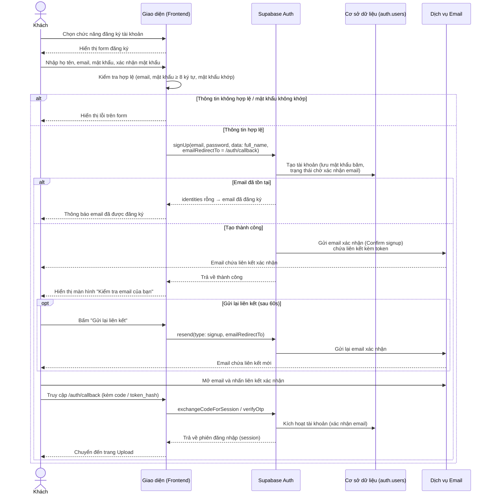

---

## 2. Đăng nhập

Biểu đồ mô tả quá trình Khách đăng nhập, hệ thống xác thực tài khoản và tạo phiên đăng nhập.

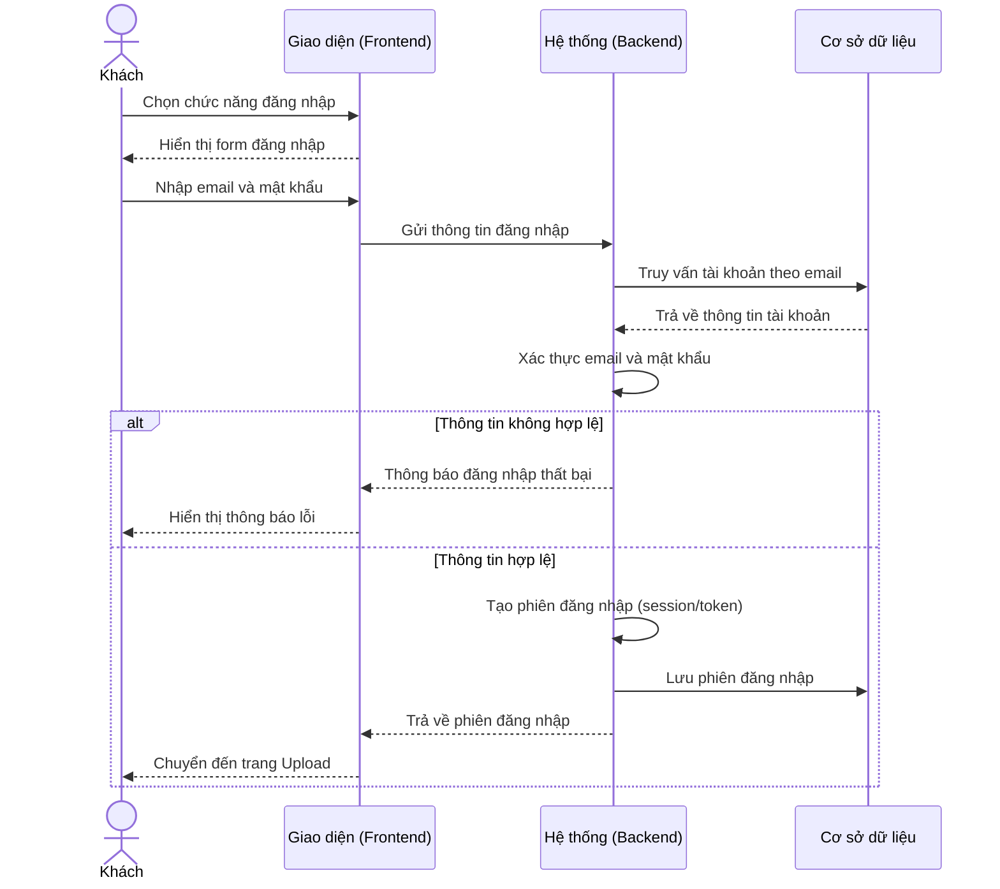

---

## 3. Quên mật khẩu (Xác thực OTP)

Biểu đồ mô tả quá trình Khách khôi phục mật khẩu bằng cách xác thực mã OTP gửi về email.

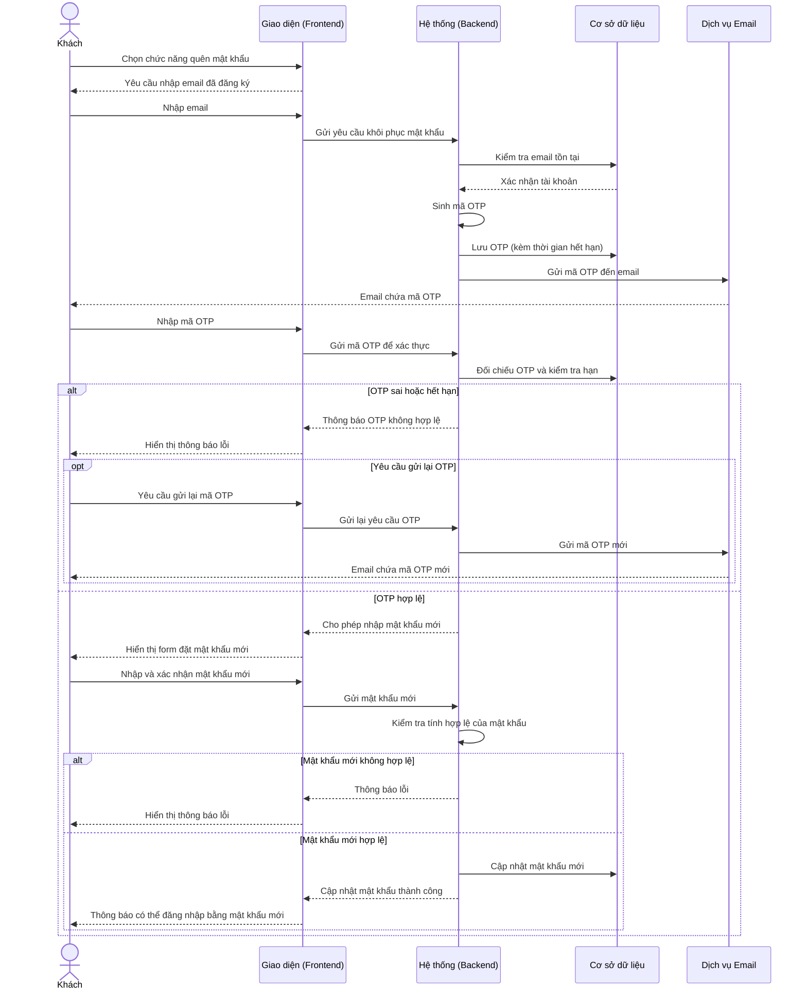

---

## 4. Upload video (Normal)

Biểu đồ mô tả quá trình Người dùng tải video lên hệ thống, chọn chế độ dịch và yêu cầu xử lý phụ đề theo chế độ Normal thông qua Colab VM2.

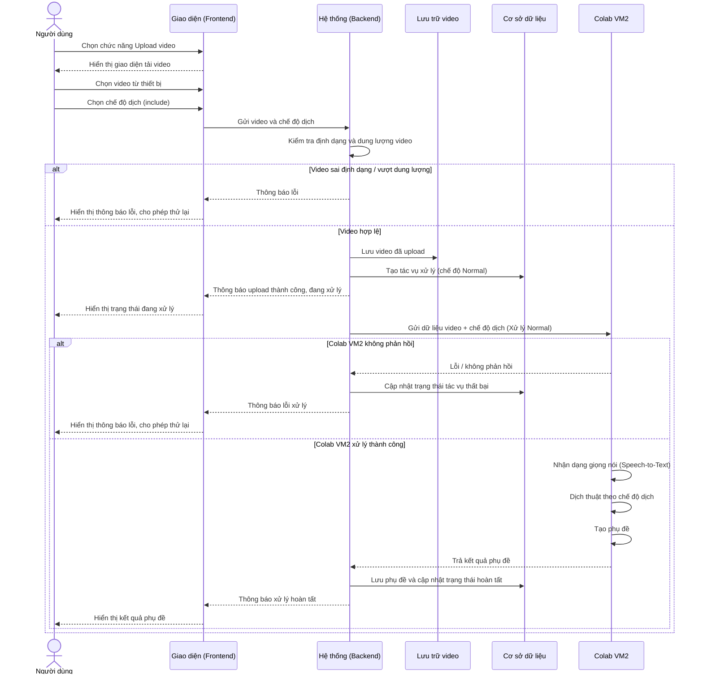

---

## 5. Xem video kèm phụ đề

Biểu đồ mô tả quá trình Người dùng mở và xem lại video đã được xử lý cùng với phụ đề tương ứng (phụ thuộc vào Use Case Upload video).

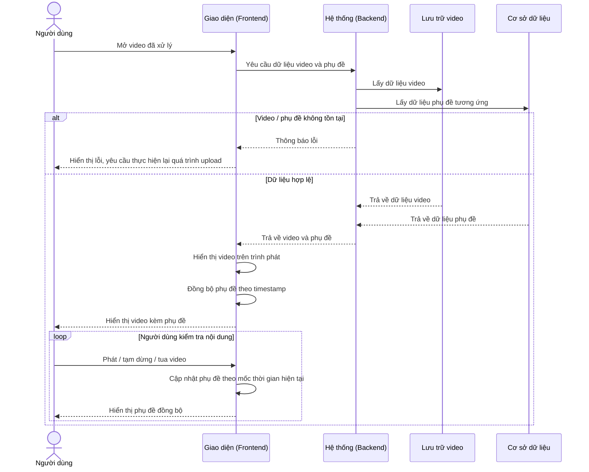

---

## 6. Chỉnh sửa phụ đề

Biểu đồ mô tả quá trình Người dùng điều chỉnh nội dung phụ đề đã được tạo tự động và lưu lại thay đổi (phụ thuộc Use Case Upload video, mở rộng bởi thao tác Lưu).

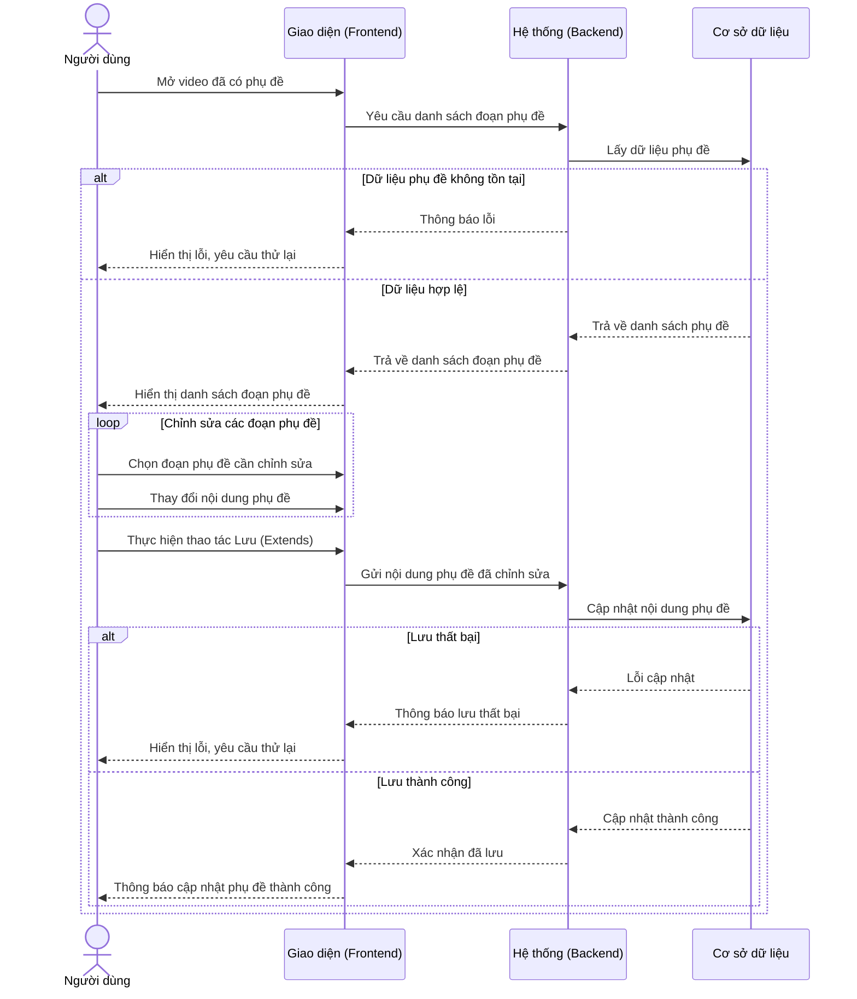

---

## 7. Tải file SRT

Biểu đồ mô tả quá trình Người dùng tải file phụ đề định dạng SRT về thiết bị (phụ thuộc Use Case Upload video, mở rộng từ Chỉnh sửa phụ đề).

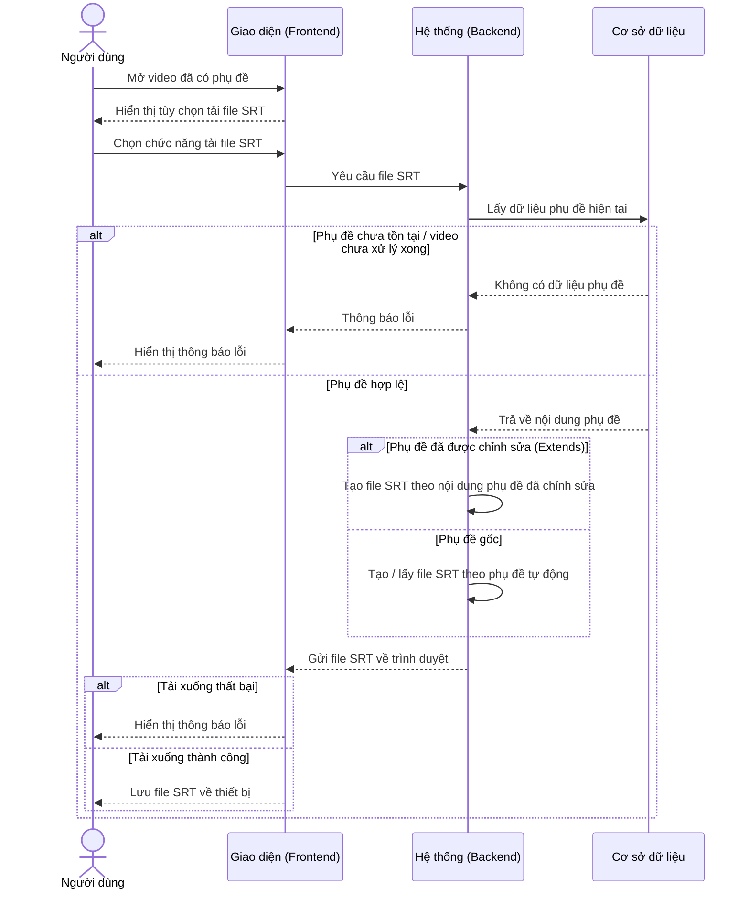

---

## 8. Nâng cấp Premium

Biểu đồ mô tả quá trình Người dùng nâng cấp tài khoản lên Premium thông qua cổng thanh toán MoMo (include Xử lý thanh toán từ MoMo).

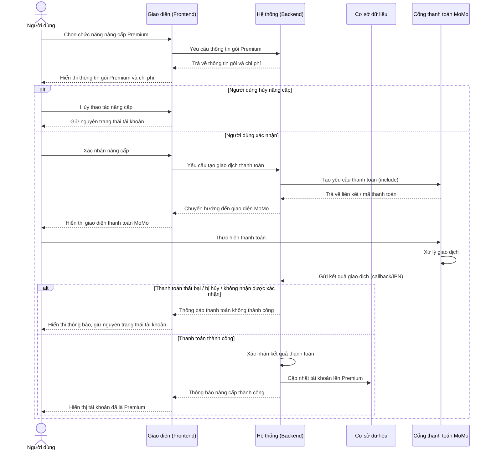

---

## 9. Xem thông tin tài khoản

Biểu đồ mô tả quá trình Người dùng xem và quản lý thông tin tài khoản (include Đăng nhập; mở rộng bởi Đổi tên, Đổi mật khẩu, Xóa tài khoản).

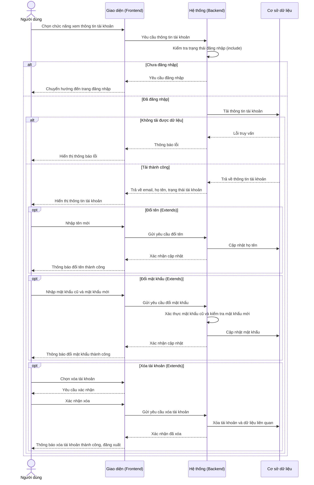

---

## 10. Xuất video kèm phụ đề

Biểu đồ mô tả quá trình Người dùng xuất video mới có phụ đề gắn trực tiếp vào khung hình (phụ thuộc Upload video; mở rộng bởi Chỉnh sửa phụ đề và Tùy chỉnh độ phân giải).

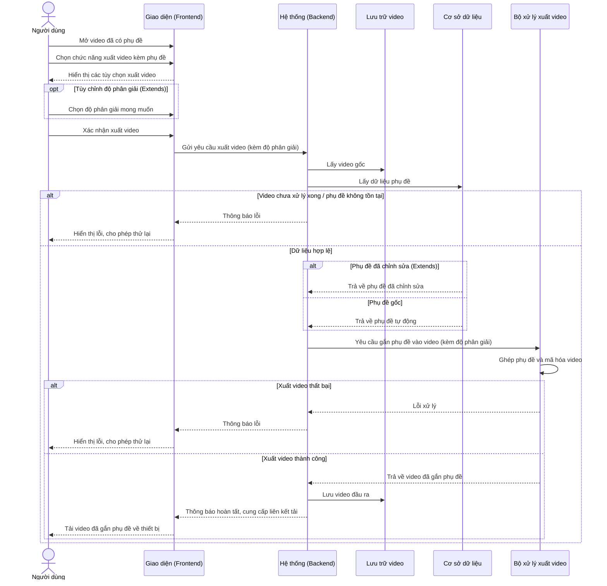

---

## 11. Upload video (Realtime)

Biểu đồ mô tả quá trình Người dùng Premium tải video lên và yêu cầu xử lý phụ đề theo chế độ Realtime (include Nâng cấp Premium, Chọn chế độ dịch và Xử lý Realtime qua Colab VM1/VM2).

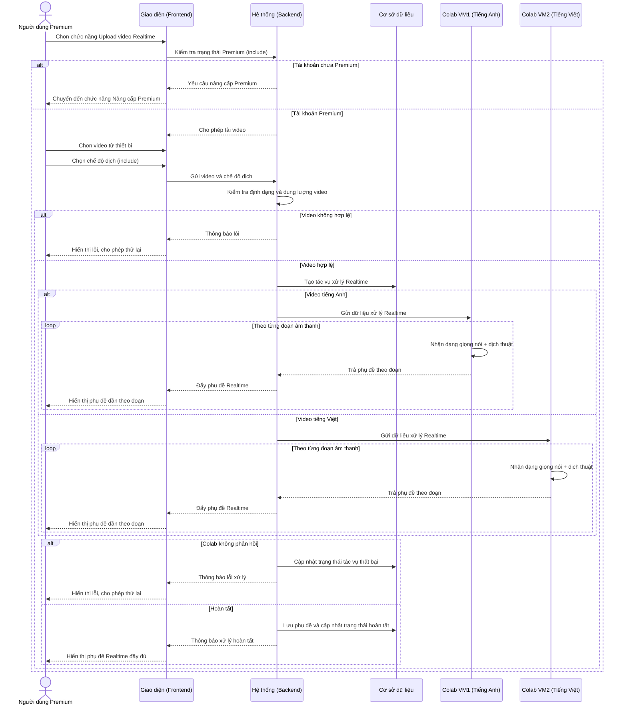
