# SubAI — System Flows & Sequence Diagrams (Mermaid)

Tất cả biểu đồ dưới đây viết bằng cú pháp Mermaid. Copy vào bất kỳ Mermaid renderer nào để xem (VS Code extension, GitHub markdown, mermaid.live).

---

## Mục lục

1. [UC-04: Đăng ký bằng Email](#uc-04-đăng-ký-bằng-email)
2. [UC-05: Đăng ký bằng Google OAuth](#uc-05-đăng-ký-bằng-google-oauth)
3. [UC-07: Đăng nhập bằng Email](#uc-07-đăng-nhập-bằng-email)
4. [UC-10: Quên mật khẩu](#uc-10-quên-mật-khẩu)
5. [UC-11: Truy cập trang Protected](#uc-11-truy-cập-trang-protected)
6. [UC-12/13/15: Upload & Xử lý Normal Mode](#uc-121315-upload--xử-lý-normal-mode)
7. [UC-14/16: Free User bị chặn (Realtime / Limit)](#uc-1416-free-user-bị-chặn)
8. [UC-32/33A: Realtime — Upload & SSE Stream](#uc-3233a-realtime--upload--sse-stream)
9. [UC-32/33B: Realtime — WebSocket Detail (EN / VI)](#uc-3233b-realtime--websocket-detail-en--vi)
10. [UC-17: Editor — Tải & Hiển thị subtitle](#uc-17-editor--tải--hiển-thị-subtitle)
11. [UC-18/19/20: Editor — Chỉnh sửa subtitle](#uc-181920-editor--chỉnh-sửa-subtitle)
12. [UC-26/27: Download SRT](#uc-2627-download-srt)
13. [UC-28: Export Video Burned Subtitle](#uc-28-export-video-burned-subtitle)
14. [UC-29: Xem thông tin tài khoản](#uc-29-xem-thông-tin-tài-khoản)
15. [UC-30: Đăng xuất](#uc-30-đăng-xuất)
16. [UC-31: Tạo Order Nâng cấp Premium](#uc-31-tạo-order-nâng-cấp-premium) x
17. [UC-36: IPN & Xác nhận Premium](#uc-36-ipn--xác-nhận-premium)
18. [UC-37: Colab VM2 xử lý ASR + MT (Normal)](#uc-37-colab-vm2-xử-lý-asr--mt-normal-mode)
19. [UC-38: Colab VM2 — VI Realtime WebSocket (PhoWhisper)](#uc-38-colab-vm2--vi-realtime-websocket-phowhisper)
20. [UC-39: Health Check](#uc-39-health-check)
21. [UC-40: Colab VM1 — EN Realtime WebSocket (Kyutai)](#uc-40-colab-vm1--en-realtime-websocket-kyutai)

---

## UC-04: Đăng ký bằng Email v

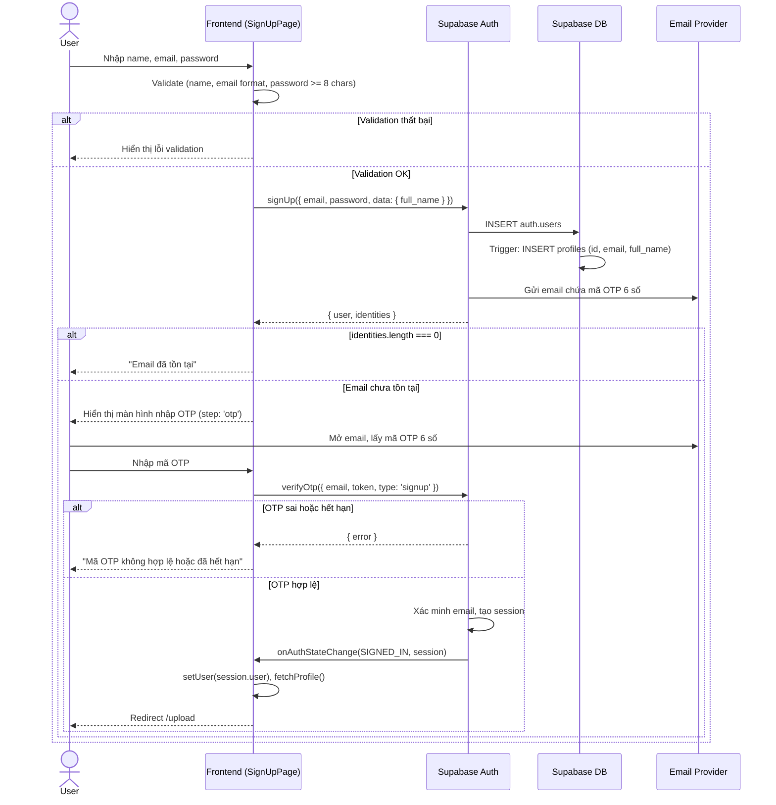
```mermaid
sequenceDiagram
    actor User
    participant FE as Frontend (SignUpPage)
    participant SB as Supabase Auth
    participant DB as Supabase DB
    participant Email as Email Provider

    User->>FE: Nhập name, email, password
    FE->>FE: Validate (name, email format, password >= 8 chars)
    alt Validation thất bại
        FE-->>User: Hiển thị lỗi validation
    else Validation OK
        FE->>SB: signUp({ email, password, data: { full_name } })
        SB->>DB: INSERT auth.users
        DB->>DB: Trigger: INSERT profiles (id, email, full_name)
        SB->>Email: Gửi email chứa mã OTP 6 số
        SB-->>FE: { user, identities }
        alt identities.length === 0
            FE-->>User: "Email đã tồn tại"
        else Email chưa tồn tại
            FE-->>User: Hiển thị màn hình nhập OTP (step: 'otp')
            User->>Email: Mở email, lấy mã OTP 6 số
            User->>FE: Nhập mã OTP
            FE->>SB: verifyOtp({ email, token, type: 'signup' })
            alt OTP sai hoặc hết hạn
                SB-->>FE: { error }
                FE-->>User: "Mã OTP không hợp lệ hoặc đã hết hạn"
            else OTP hợp lệ
                SB->>SB: Xác minh email, tạo session
                SB->>FE: onAuthStateChange(SIGNED_IN, session)
                FE->>FE: setUser(session.user), fetchProfile()
                FE-->>User: Redirect /upload
            end
        end
    end
```

---

## UC-05: Đăng ký bằng Google OAuth v

Áp dụng tương tự cho UC-06 (GitHub), UC-08 (Google login), UC-09 (GitHub login).

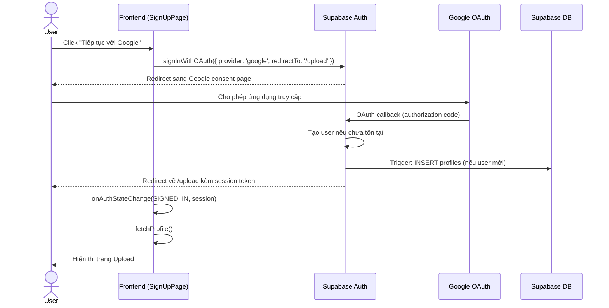
```mermaid
sequenceDiagram
    actor User
    participant FE as Frontend (SignUpPage)
    participant SB as Supabase Auth
    participant Google as Google OAuth
    participant DB as Supabase DB

    User->>FE: Click "Tiếp tục với Google"
    FE->>SB: signInWithOAuth({ provider: 'google', redirectTo: '/upload' })
    SB-->>User: Redirect sang Google consent page
    User->>Google: Cho phép ứng dụng truy cập
    Google->>SB: OAuth callback (authorization code)
    SB->>SB: Tạo user nếu chưa tồn tại
    SB->>DB: Trigger: INSERT profiles (nếu user mới)
    SB-->>User: Redirect về /upload kèm session token
    FE->>FE: onAuthStateChange(SIGNED_IN, session)
    FE->>FE: fetchProfile()
    FE-->>User: Hiển thị trang Upload
```

---

## UC-07: Đăng nhập bằng Email v

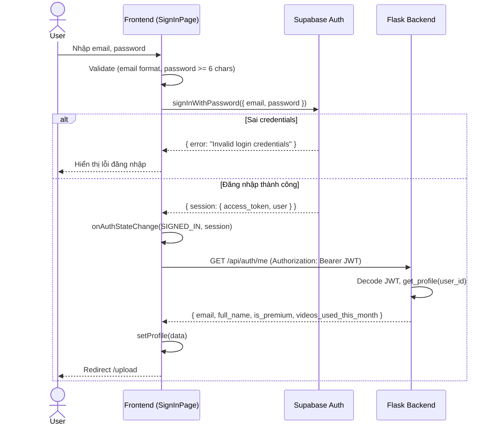
```mermaid
sequenceDiagram
    actor User
    participant FE as Frontend (SignInPage)
    participant SB as Supabase Auth
    participant Flask as Flask Backend

    User->>FE: Nhập email, password
    FE->>FE: Validate (email format, password >= 6 chars)
    FE->>SB: signInWithPassword({ email, password })
    alt Sai credentials
        SB-->>FE: { error: "Invalid login credentials" }
        FE-->>User: Hiển thị lỗi đăng nhập
    else Đăng nhập thành công
        SB-->>FE: { session: { access_token, user } }
        FE->>FE: onAuthStateChange(SIGNED_IN, session)
        FE->>Flask: GET /api/auth/me (Authorization: Bearer JWT)
        Flask->>Flask: Decode JWT, get_profile(user_id)
        Flask-->>FE: { email, full_name, is_premium, videos_used_this_month }
        FE->>FE: setProfile(data)
        FE-->>User: Redirect /upload
    end
```

---

## UC-10: Quên mật khẩu v

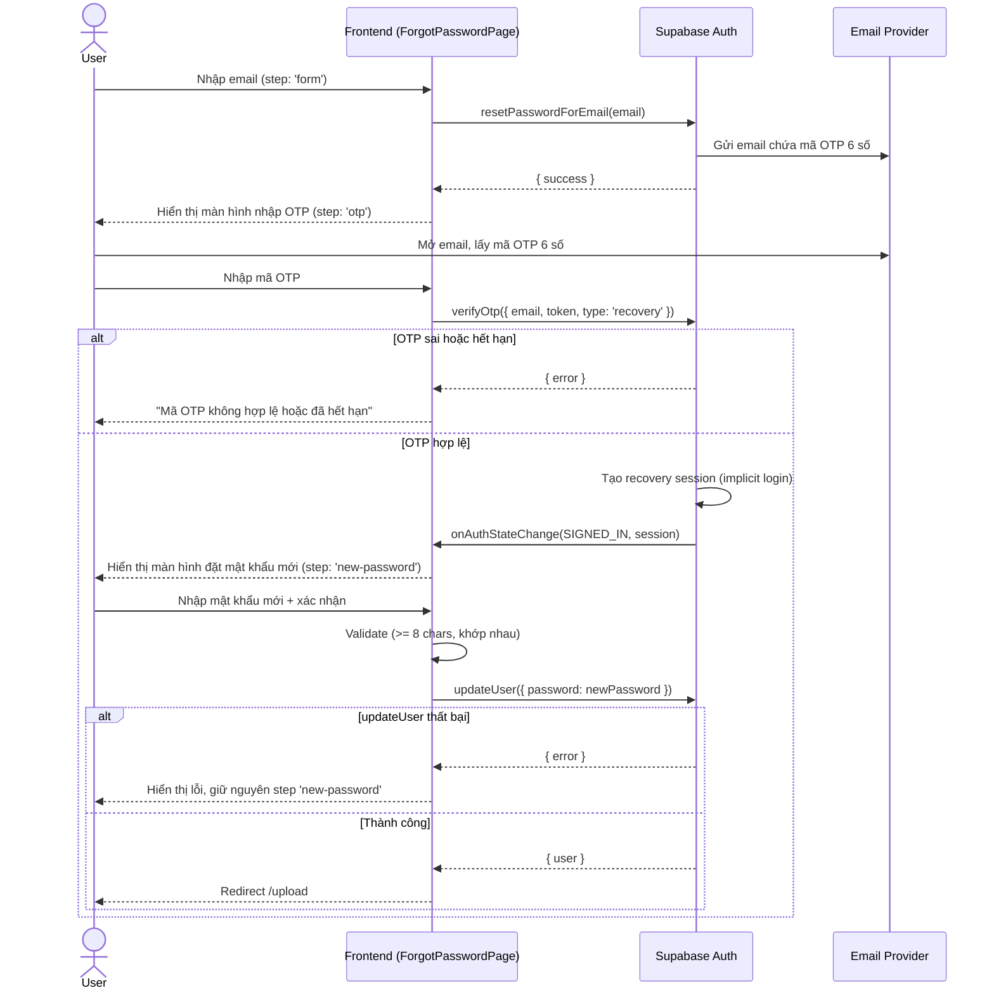
```mermaid
sequenceDiagram
    actor User
    participant FE as Frontend (ForgotPasswordPage)
    participant SB as Supabase Auth
    participant Email as Email Provider

    User->>FE: Nhập email (step: 'form')
    FE->>SB: resetPasswordForEmail(email)
    SB->>Email: Gửi email chứa mã OTP 6 số
    SB-->>FE: { success }
    FE-->>User: Hiển thị màn hình nhập OTP (step: 'otp')
    User->>Email: Mở email, lấy mã OTP 6 số
    User->>FE: Nhập mã OTP
    FE->>SB: verifyOtp({ email, token, type: 'recovery' })
    alt OTP sai hoặc hết hạn
        SB-->>FE: { error }
        FE-->>User: "Mã OTP không hợp lệ hoặc đã hết hạn"
    else OTP hợp lệ
        SB->>SB: Tạo recovery session (implicit login)
        SB->>FE: onAuthStateChange(SIGNED_IN, session)
        FE-->>User: Hiển thị màn hình đặt mật khẩu mới (step: 'new-password')
        User->>FE: Nhập mật khẩu mới + xác nhận
        FE->>FE: Validate (>= 8 chars, khớp nhau)
        FE->>SB: updateUser({ password: newPassword })
        alt updateUser thất bại
            SB-->>FE: { error }
            FE-->>User: Hiển thị lỗi, giữ nguyên step 'new-password'
        else Thành công
            SB-->>FE: { user }
            FE-->>User: Redirect /upload
        end
    end
```

---

## UC-11: Truy cập trang Protected v

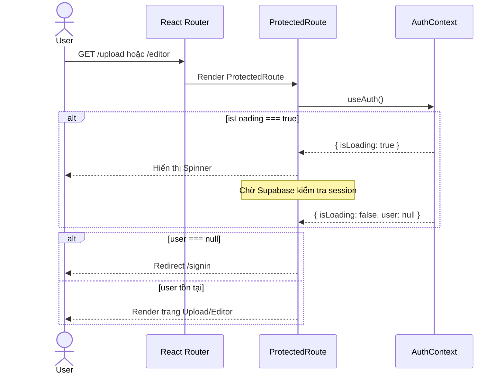
```mermaid
sequenceDiagram
    actor User
    participant Router as React Router
    participant PR as ProtectedRoute
    participant Auth as AuthContext

    User->>Router: GET /upload hoặc /editor
    Router->>PR: Render ProtectedRoute
    PR->>Auth: useAuth()

    alt isLoading === true
        Auth-->>PR: { isLoading: true }
        PR-->>User: Hiển thị Spinner
        Note over PR: Chờ Supabase kiểm tra session
        Auth-->>PR: { isLoading: false, user: null }
    end

    alt user === null
        PR-->>User: Redirect /signin
    else user tồn tại
        PR-->>User: Render trang Upload/Editor
    end
```

---

## UC-12/13/15: Upload & Xử lý Normal Mode v

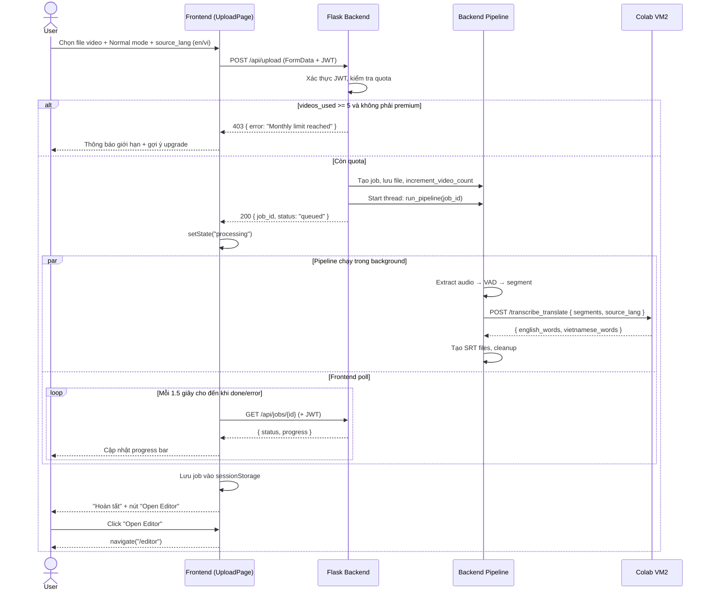
```mermaid
sequenceDiagram
    actor User
    participant FE as Frontend (UploadPage)
    participant Flask as Flask Backend
    participant Pipeline as Backend Pipeline
    participant VM2 as Colab VM2

    User->>FE: Chọn file video + Normal mode + source_lang (en/vi)
    FE->>Flask: POST /api/upload (FormData + JWT)
    Flask->>Flask: Xác thực JWT, kiểm tra quota
    alt videos_used >= 5 và không phải premium
        Flask-->>FE: 403 { error: "Monthly limit reached" }
        FE-->>User: Thông báo giới hạn + gợi ý upgrade
    else Còn quota
        Flask->>Pipeline: Tạo job, lưu file, increment_video_count
        Flask->>Pipeline: Start thread: run_pipeline(job_id)
        Flask-->>FE: 200 { job_id, status: "queued" }
        FE->>FE: setState("processing")

        par Pipeline chạy trong background
            Pipeline->>Pipeline: Extract audio → VAD → segment
            Pipeline->>VM2: POST /transcribe_translate { segments, source_lang }
            VM2-->>Pipeline: { english_words, vietnamese_words }
            Pipeline->>Pipeline: Tạo SRT files, cleanup
        and Frontend poll
            loop Mỗi 1.5 giây cho đến khi done/error
                FE->>Flask: GET /api/jobs/{id} (+ JWT)
                Flask-->>FE: { status, progress }
                FE-->>User: Cập nhật progress bar
            end
        end

        FE->>FE: Lưu job vào sessionStorage
        FE-->>User: "Hoàn tất" + nút "Open Editor"
        User->>FE: Click "Open Editor"
        FE-->>User: navigate("/editor")
    end
```

---

## UC-14/16: Free User bị chặn v

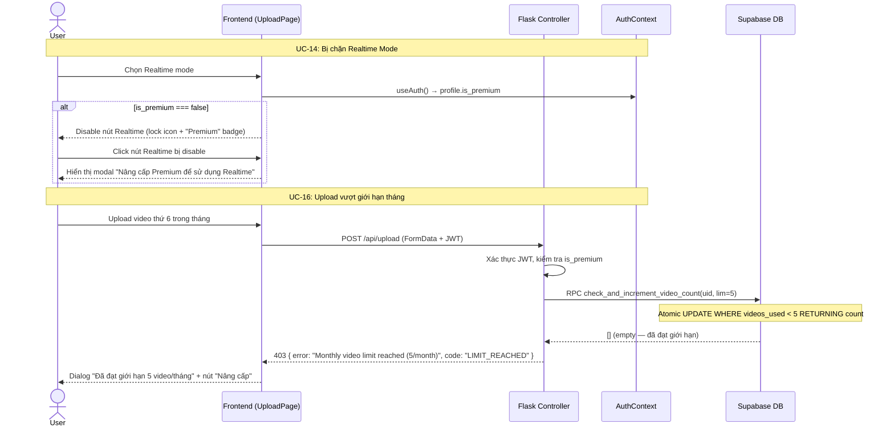
```mermaid
sequenceDiagram
    actor User
    participant FE as Frontend (UploadPage)
    participant Flask as Flask Controller
    participant Auth as AuthContext
    participant DB as Supabase DB

    Note over User,Auth: UC-14: Bị chặn Realtime Mode
    User->>FE: Chọn Realtime mode
    FE->>Auth: useAuth() → profile.is_premium
    alt is_premium === false
        FE-->>User: Disable nút Realtime (lock icon + "Premium" badge)
        User->>FE: Click nút Realtime bị disable
        FE-->>User: Hiển thị modal "Nâng cấp Premium để sử dụng Realtime"
    end

    Note over User,Auth: UC-16: Upload vượt giới hạn tháng
    User->>FE: Upload video thứ 6 trong tháng
    FE->>Flask: POST /api/upload (FormData + JWT)
    Flask->>Flask: Xác thực JWT, kiểm tra is_premium
    Flask->>DB: RPC check_and_increment_video_count(uid, lim=5)
    Note over DB: Atomic UPDATE WHERE videos_used < 5 RETURNING count
    DB-->>Flask: [] (empty — đã đạt giới hạn)
    Flask-->>FE: 403 { error: "Monthly video limit reached (5/month)", code: "LIMIT_REACHED" }
    FE-->>User: Dialog "Đã đạt giới hạn 5 video/tháng" + nút "Nâng cấp"
```

---

## UC-32/33A: Realtime — Upload & SSE Stream v

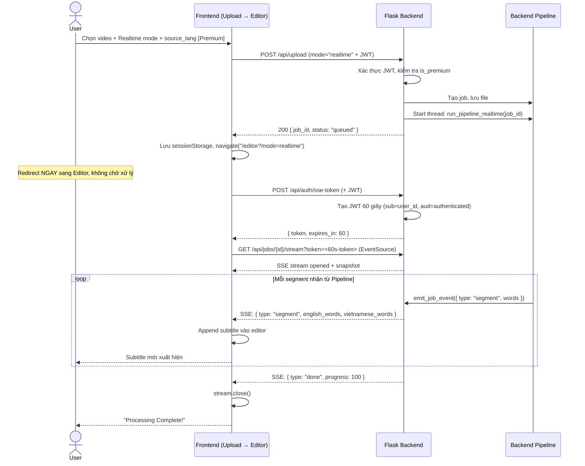
```mermaid
sequenceDiagram
    actor User
    participant FE as Frontend (Upload → Editor)
    participant Flask as Flask Backend
    participant Pipeline as Backend Pipeline

    User->>FE: Chọn video + Realtime mode + source_lang [Premium]
    FE->>Flask: POST /api/upload (mode="realtime" + JWT)
    Flask->>Flask: Xác thực JWT, kiểm tra is_premium
    Flask->>Pipeline: Tạo job, lưu file
    Flask->>Pipeline: Start thread: run_pipeline_realtime(job_id)
    Flask-->>FE: 200 { job_id, status: "queued" }

    FE->>FE: Lưu sessionStorage, navigate("/editor?mode=realtime")
    Note over User: Redirect NGAY sang Editor, không chờ xử lý

    FE->>Flask: POST /api/auth/sse-token (+ JWT)
    Flask->>Flask: Tạo JWT 60 giây (sub=user_id, aud=authenticated)
    Flask-->>FE: { token, expires_in: 60 }

    FE->>Flask: GET /api/jobs/{id}/stream?token=<60s-token> (EventSource)
    Flask-->>FE: SSE stream opened + snapshot

    loop Mỗi segment nhận từ Pipeline
        Pipeline->>Flask: emit_job_event({ type: "segment", words })
        Flask-->>FE: SSE: { type: "segment", english_words, vietnamese_words }
        FE->>FE: Append subtitle vào editor
        FE-->>User: Subtitle mới xuất hiện
    end

    Flask-->>FE: SSE: { type: "done", progress: 100 }
    FE->>FE: stream.close()
    FE-->>User: "Processing Complete!"
```

---

## UC-32/33B: Realtime — WebSocket Detail (EN / VI) v

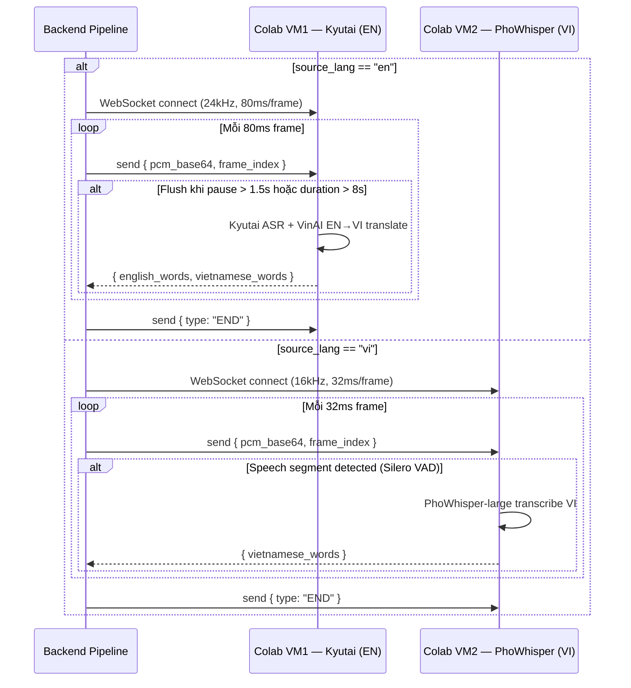
```mermaid
sequenceDiagram
    participant Pipeline as Backend Pipeline
    participant VM1 as Colab VM1 — Kyutai (EN)
    participant VM2 as Colab VM2 — PhoWhisper (VI)

    alt source_lang == "en"
        Pipeline->>VM1: WebSocket connect (24kHz, 80ms/frame)
        loop Mỗi 80ms frame
            Pipeline->>VM1: send { pcm_base64, frame_index }
            alt Flush khi pause > 1.5s hoặc duration > 8s
                VM1->>VM1: Kyutai ASR + VinAI EN→VI translate
                VM1-->>Pipeline: { english_words, vietnamese_words }
            end
        end
        Pipeline->>VM1: send { type: "END" }
    else source_lang == "vi"
        Pipeline->>VM2: WebSocket connect (16kHz, 32ms/frame)
        loop Mỗi 32ms frame
            Pipeline->>VM2: send { pcm_base64, frame_index }
            alt Speech segment detected (Silero VAD)
                VM2->>VM2: PhoWhisper-large transcribe VI
                VM2-->>Pipeline: { vietnamese_words }
            end
        end
        Pipeline->>VM2: send { type: "END" }
    end
```

---

## UC-17: Editor — Tải & Hiển thị subtitle v

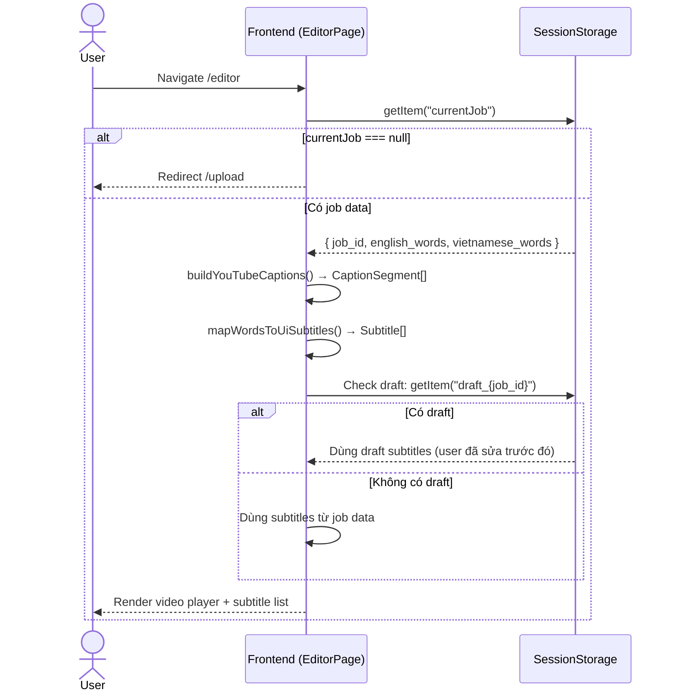
```mermaid
sequenceDiagram
    actor User
    participant FE as Frontend (EditorPage)
    participant SS as SessionStorage

    User->>FE: Navigate /editor
    FE->>SS: getItem("currentJob")
    alt currentJob === null
        FE-->>User: Redirect /upload
    else Có job data
        SS-->>FE: { job_id, english_words, vietnamese_words }
        FE->>FE: buildYouTubeCaptions() → CaptionSegment[]
        FE->>FE: mapWordsToUiSubtitles() → Subtitle[]
        FE->>SS: Check draft: getItem("draft_{job_id}")
        alt Có draft
            SS-->>FE: Dùng draft subtitles (user đã sửa trước đó)
        else Không có draft
            FE->>FE: Dùng subtitles từ job data
        end
        FE-->>User: Render video player + subtitle list
    end
```

---

## UC-18/19/20: Editor — Chỉnh sửa subtitle v

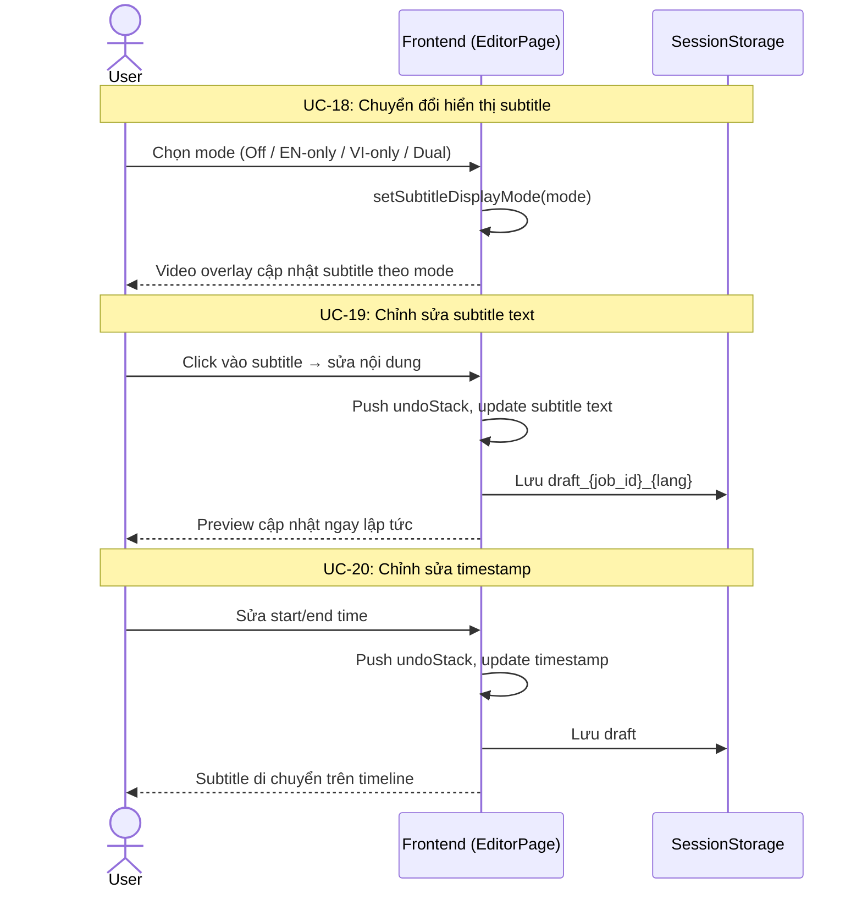
```mermaid
sequenceDiagram
    actor User
    participant FE as Frontend (EditorPage)
    participant SS as SessionStorage

    Note over User,SS: UC-18: Chuyển đổi hiển thị subtitle
    User->>FE: Chọn mode (Off / EN-only / VI-only / Dual)
    FE->>FE: setSubtitleDisplayMode(mode)
    FE-->>User: Video overlay cập nhật subtitle theo mode

    Note over User,SS: UC-19: Chỉnh sửa subtitle text
    User->>FE: Click vào subtitle → sửa nội dung
    FE->>FE: Push undoStack, update subtitle text
    FE->>SS: Lưu draft_{job_id}_{lang}
    FE-->>User: Preview cập nhật ngay lập tức

    Note over User,SS: UC-20: Chỉnh sửa timestamp
    User->>FE: Sửa start/end time
    FE->>FE: Push undoStack, update timestamp
    FE->>SS: Lưu draft
    FE-->>User: Subtitle di chuyển trên timeline
```

---

## UC-26/27: Download SRT v

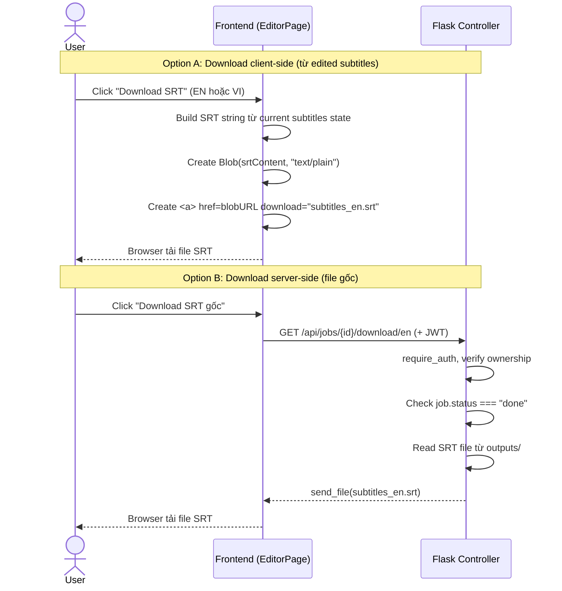
```mermaid
sequenceDiagram
    actor User
    participant FE as Frontend (EditorPage)
    participant Flask as Flask Controller

    Note over User,Flask: Option A: Download client-side (từ edited subtitles)
    User->>FE: Click "Download SRT" (EN hoặc VI)
    FE->>FE: Build SRT string từ current subtitles state
    FE->>FE: Create Blob(srtContent, "text/plain")
    FE->>FE: Create <a> href=blobURL download="subtitles_en.srt"
    FE-->>User: Browser tải file SRT

    Note over User,Flask: Option B: Download server-side (file gốc)
    User->>FE: Click "Download SRT gốc"
    FE->>Flask: GET /api/jobs/{id}/download/en (+ JWT)
    Flask->>Flask: require_auth, verify ownership
    Flask->>Flask: Check job.status === "done"
    Flask->>Flask: Read SRT file từ outputs/
    Flask-->>FE: send_file(subtitles_en.srt)
    FE-->>User: Browser tải file SRT
```

---

## UC-28: Export Video Burned Subtitle v

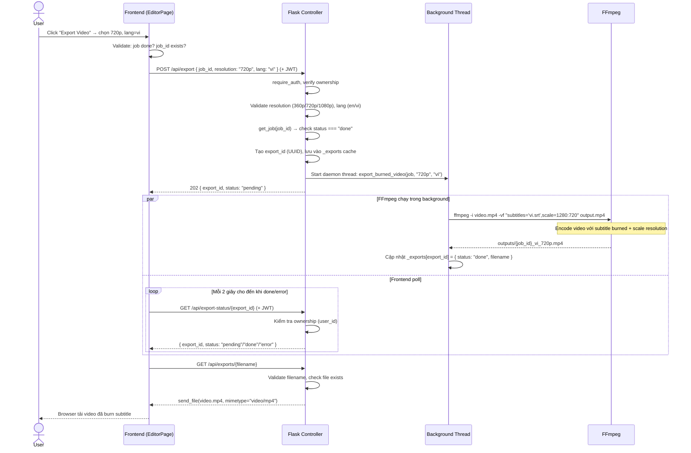
```mermaid
sequenceDiagram
    actor User
    participant FE as Frontend (EditorPage)
    participant Flask as Flask Controller
    participant Thread as Background Thread
    participant FFmpeg as FFmpeg

    User->>FE: Click "Export Video" → chọn 720p, lang=vi
    FE->>FE: Validate: job done? job_id exists?
    FE->>Flask: POST /api/export { job_id, resolution: "720p", lang: "vi" } (+ JWT)

    Flask->>Flask: require_auth, verify ownership
    Flask->>Flask: Validate resolution (360p/720p/1080p), lang (en/vi)
    Flask->>Flask: get_job(job_id) → check status === "done"
    Flask->>Flask: Tạo export_id (UUID), lưu vào _exports cache
    Flask->>Thread: Start daemon thread: export_burned_video(job, "720p", "vi")
    Flask-->>FE: 202 { export_id, status: "pending" }

    par FFmpeg chạy trong background
        Thread->>FFmpeg: ffmpeg -i video.mp4 -vf "subtitles='vi.srt',scale=1280:720" output.mp4
        Note over FFmpeg: Encode video với subtitle burned + scale resolution
        FFmpeg-->>Thread: outputs/{job_id}_vi_720p.mp4
        Thread->>Thread: Cập nhật _exports[export_id] = { status: "done", filename }
    and Frontend poll
        loop Mỗi 2 giây cho đến khi done/error
            FE->>Flask: GET /api/export-status/{export_id} (+ JWT)
            Flask->>Flask: Kiểm tra ownership (user_id)
            Flask-->>FE: { export_id, status: "pending"/"done"/"error" }
        end
    end

    FE->>Flask: GET /api/exports/{filename}
    Flask->>Flask: Validate filename, check file exists
    Flask-->>FE: send_file(video.mp4, mimetype="video/mp4")
    FE-->>User: Browser tải video đã burn subtitle
```

---

## UC-29: Xem thông tin tài khoản v

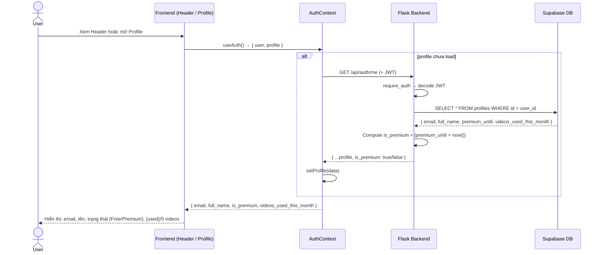
```mermaid
sequenceDiagram
    actor User
    participant FE as Frontend (Header / Profile)
    participant Auth as AuthContext
    participant Flask as Flask Backend
    participant DB as Supabase DB

    User->>FE: Xem Header hoặc mở Profile
    FE->>Auth: useAuth() → { user, profile }

    alt profile chưa load
        Auth->>Flask: GET /api/auth/me (+ JWT)
        Flask->>Flask: require_auth → decode JWT
        Flask->>DB: SELECT * FROM profiles WHERE id = user_id
        DB-->>Flask: { email, full_name, premium_until, videos_used_this_month }
        Flask->>Flask: Compute is_premium = (premium_until > now())
        Flask-->>Auth: { ...profile, is_premium: true/false }
        Auth->>Auth: setProfile(data)
    end

    Auth-->>FE: { email, full_name, is_premium, videos_used_this_month }
    FE-->>User: Hiển thị: email, tên, trạng thái (Free/Premium), {used}/5 videos
```

---

## UC-30: Đăng xuất v

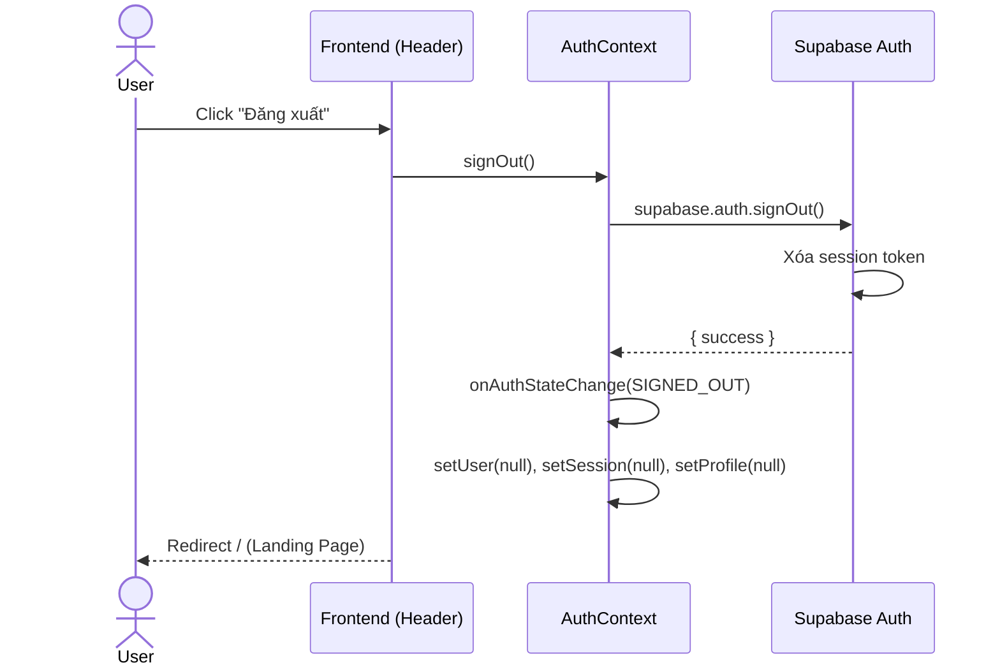
```mermaid
sequenceDiagram
    actor User
    participant FE as Frontend (Header)
    participant Auth as AuthContext
    participant SB as Supabase Auth

    User->>FE: Click "Đăng xuất"
    FE->>Auth: signOut()
    Auth->>SB: supabase.auth.signOut()
    SB->>SB: Xóa session token
    SB-->>Auth: { success }
    Auth->>Auth: onAuthStateChange(SIGNED_OUT)
    Auth->>Auth: setUser(null), setSession(null), setProfile(null)
    FE-->>User: Redirect / (Landing Page)
```

---

## UC-31: Tạo Order Nâng cấp Premium x

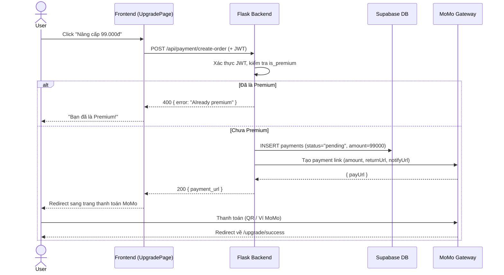
```mermaid
sequenceDiagram
    actor User
    participant FE as Frontend (UpgradePage)
    participant Flask as Flask Backend
    participant DB as Supabase DB
    participant MoMo as MoMo Gateway

    User->>FE: Click "Nâng cấp 99.000đ"
    FE->>Flask: POST /api/payment/create-order (+ JWT)
    Flask->>Flask: Xác thực JWT, kiểm tra is_premium
    alt Đã là Premium
        Flask-->>FE: 400 { error: "Already premium" }
        FE-->>User: "Bạn đã là Premium!"
    else Chưa Premium
        Flask->>DB: INSERT payments (status="pending", amount=99000)
        Flask->>MoMo: Tạo payment link (amount, returnUrl, notifyUrl)
        MoMo-->>Flask: { payUrl }
        Flask-->>FE: 200 { payment_url }
        FE-->>User: Redirect sang trang thanh toán MoMo
        User->>MoMo: Thanh toán (QR / Ví MoMo)
        MoMo-->>User: Redirect về /upgrade/success
    end
```

---

## UC-36: IPN & Xác nhận Premium

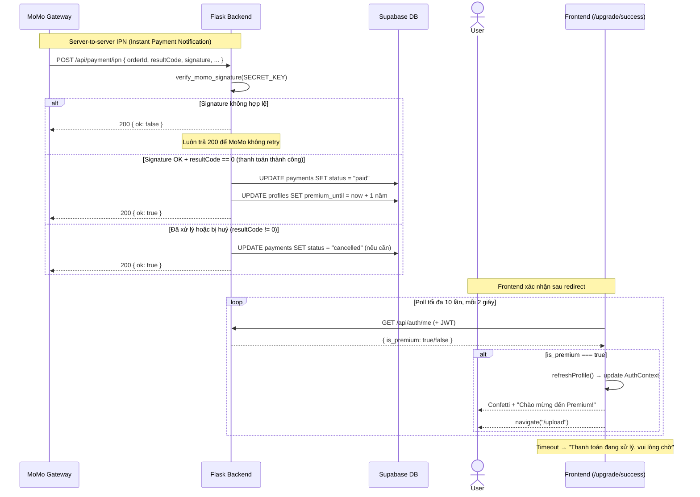
```mermaid
sequenceDiagram
    participant MoMo as MoMo Gateway
    participant Flask as Flask Backend
    participant DB as Supabase DB
    actor User
    participant FE as Frontend (/upgrade/success)

    Note over MoMo,Flask: Server-to-server IPN (Instant Payment Notification)
    MoMo->>Flask: POST /api/payment/ipn { orderId, resultCode, signature, ... }
    Flask->>Flask: verify_momo_signature(SECRET_KEY)
    alt Signature không hợp lệ
        Flask-->>MoMo: 200 { ok: false }
        Note over Flask: Luôn trả 200 để MoMo không retry
    else Signature OK + resultCode == 0 (thanh toán thành công)
        Flask->>DB: UPDATE payments SET status = "paid"
        Flask->>DB: UPDATE profiles SET premium_until = now + 1 năm
        Flask-->>MoMo: 200 { ok: true }
    else Đã xử lý hoặc bị huỷ (resultCode != 0)
        Flask->>DB: UPDATE payments SET status = "cancelled" (nếu cần)
        Flask-->>MoMo: 200 { ok: true }
    end

    Note over User,FE: Frontend xác nhận sau redirect
    loop Poll tối đa 10 lần, mỗi 2 giây
        FE->>Flask: GET /api/auth/me (+ JWT)
        Flask-->>FE: { is_premium: true/false }
        alt is_premium === true
            FE->>FE: refreshProfile() → update AuthContext
            FE-->>User: Confetti + "Chào mừng đến Premium!"
            FE-->>User: navigate("/upload")
        end
    end
    Note over FE: Timeout → "Thanh toán đang xử lý, vui lòng chờ"
```

---

## UC-37: Colab VM2 xử lý ASR + MT (Normal Mode) v

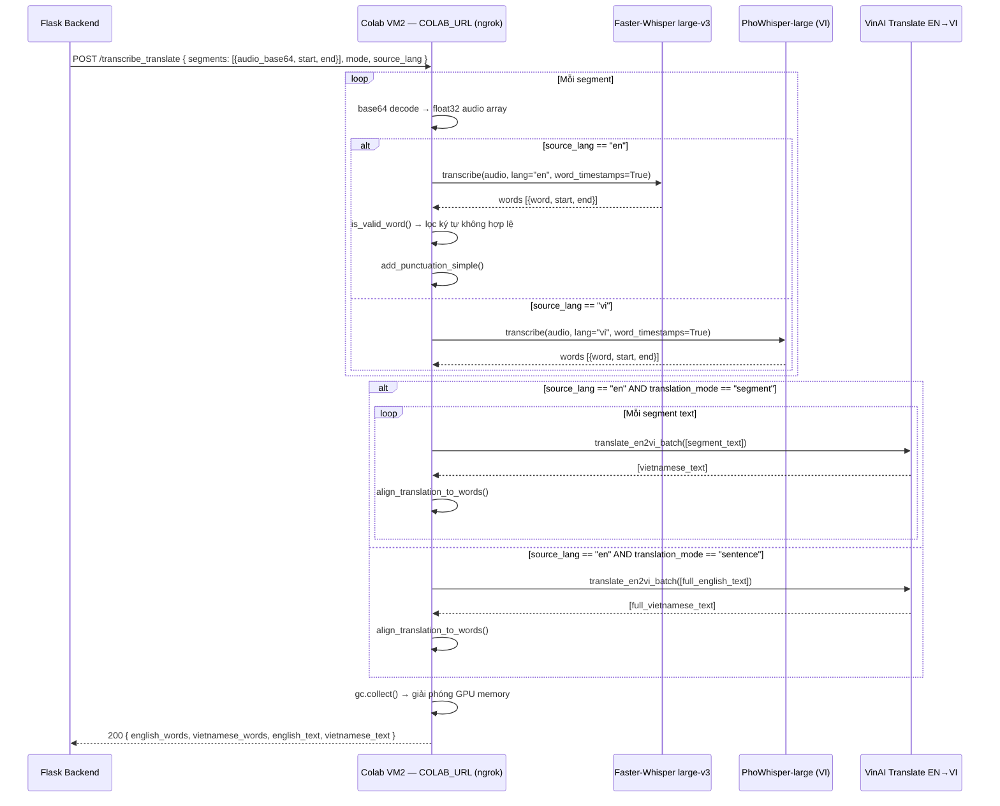
```mermaid
sequenceDiagram
    participant Flask as Flask Backend
    participant VM2 as Colab VM2 — COLAB_URL (ngrok)
    participant Whisper as Faster-Whisper large-v3
    participant PhoW as PhoWhisper-large (VI)
    participant VinAI as VinAI Translate EN→VI

    Flask->>VM2: POST /transcribe_translate { segments: [{audio_base64, start, end}], mode, source_lang }

    loop Mỗi segment
        VM2->>VM2: base64 decode → float32 audio array
        alt source_lang == "en"
            VM2->>Whisper: transcribe(audio, lang="en", word_timestamps=True)
            Whisper-->>VM2: words [{word, start, end}]
            VM2->>VM2: is_valid_word() → lọc ký tự không hợp lệ
            VM2->>VM2: add_punctuation_simple()
        else source_lang == "vi"
            VM2->>PhoW: transcribe(audio, lang="vi", word_timestamps=True)
            PhoW-->>VM2: words [{word, start, end}]
        end
    end

    alt source_lang == "en" AND translation_mode == "segment"
        loop Mỗi segment text
            VM2->>VinAI: translate_en2vi_batch([segment_text])
            VinAI-->>VM2: [vietnamese_text]
            VM2->>VM2: align_translation_to_words()
        end
    else source_lang == "en" AND translation_mode == "sentence"
        VM2->>VinAI: translate_en2vi_batch([full_english_text])
        VinAI-->>VM2: [full_vietnamese_text]
        VM2->>VM2: align_translation_to_words()
    end

    VM2->>VM2: gc.collect() → giải phóng GPU memory
    VM2-->>Flask: 200 { english_words, vietnamese_words, english_text, vietnamese_text }
```

---

## UC-38: Colab VM2 — VI Realtime WebSocket (PhoWhisper) v

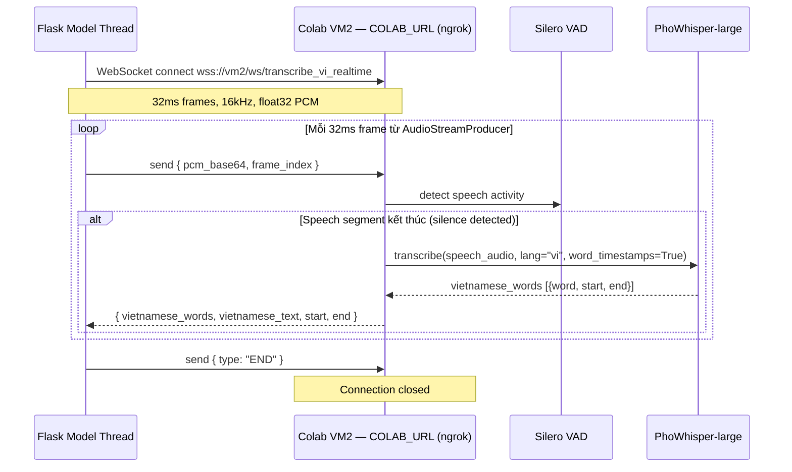
```mermaid
sequenceDiagram
    participant Model as Flask Model Thread
    participant VM2 as Colab VM2 — COLAB_URL (ngrok)
    participant VAD as Silero VAD
    participant PhoW as PhoWhisper-large

    Model->>VM2: WebSocket connect wss://vm2/ws/transcribe_vi_realtime
    Note over Model,VM2: 32ms frames, 16kHz, float32 PCM

    loop Mỗi 32ms frame từ AudioStreamProducer
        Model->>VM2: send { pcm_base64, frame_index }
        VM2->>VAD: detect speech activity
        alt Speech segment kết thúc (silence detected)
            VM2->>PhoW: transcribe(speech_audio, lang="vi", word_timestamps=True)
            PhoW-->>VM2: vietnamese_words [{word, start, end}]
            VM2-->>Model: { vietnamese_words, vietnamese_text, start, end }
        end
    end

    Model->>VM2: send { type: "END" }
    Note over VM2: Connection closed
```

---

## UC-39: Health Check v

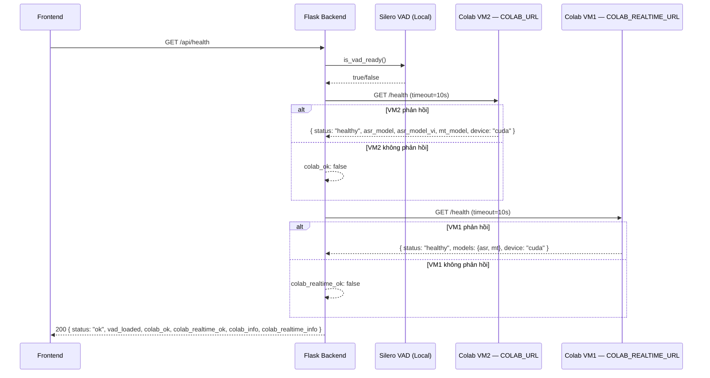
```mermaid
sequenceDiagram
    participant FE as Frontend
    participant Flask as Flask Backend
    participant VAD as Silero VAD (Local)
    participant VM2 as Colab VM2 — COLAB_URL
    participant VM1 as Colab VM1 — COLAB_REALTIME_URL

    FE->>Flask: GET /api/health
    Flask->>VAD: is_vad_ready()
    VAD-->>Flask: true/false

    Flask->>VM2: GET /health (timeout=10s)
    alt VM2 phản hồi
        VM2-->>Flask: { status: "healthy", asr_model, asr_model_vi, mt_model, device: "cuda" }
    else VM2 không phản hồi
        Flask-->>Flask: colab_ok: false
    end

    Flask->>VM1: GET /health (timeout=10s)
    alt VM1 phản hồi
        VM1-->>Flask: { status: "healthy", models: {asr, mt}, device: "cuda" }
    else VM1 không phản hồi
        Flask-->>Flask: colab_realtime_ok: false
    end

    Flask-->>FE: 200 { status: "ok", vad_loaded, colab_ok, colab_realtime_ok, colab_info, colab_realtime_info }
```

---

## UC-40: Colab VM1 — EN Realtime WebSocket (Kyutai) v

```mermaid
sequenceDiagram
    participant Model as Flask Model Thread
    participant VM1 as Colab VM1 — COLAB_REALTIME_URL (ngrok)
    participant Kyutai as Kyutai stt-1b-en_fr
    participant VinAI as VinAI Translate EN→VI

    Model->>VM1: WebSocket connect wss://vm1/ws/transcribe_kyutai
    Note over Model,VM1: 80ms frames, 24kHz, float32 PCM

    loop Mỗi 80ms frame từ AudioStreamProducer
        Model->>VM1: send { pcm_base64, frame_index }
        VM1->>Kyutai: mimi.encode(audio_chunk) → audio_tokens
        VM1->>Kyutai: lm.step(audio_tokens) → text_token
        alt text_token > 0 (có nội dung)
            VM1->>VM1: decode token → detect word boundary
            alt Accumulated words → flush (pause > 1.5s hoặc duration > 8s)
                VM1->>VinAI: translate_en2vi_batch([en_text])
                VinAI-->>VM1: vietnamese_text
                VM1->>VM1: align_translation_to_words()
                VM1-->>Model: { english_words, vietnamese_words, english_text, vietnamese_text, start, end }
            end
        end
    end

    Model->>VM1: send { type: "END" }
    alt Còn words chưa flush
        VM1->>VinAI: translate final segment
        VM1-->>Model: final segment result
    end
    Note over VM1: Connection closed
```

---

## Tổng quan luồng dữ liệu hệ thống

```mermaid
flowchart TB
    subgraph Client ["Frontend (React + Vite)"]
        LP[Landing Page]
        Auth[SignIn / SignUp]
        UP[Upload Page]
        ED[Editor Page]
        UG[Upgrade Page]
    end

    subgraph Backend ["Flask Backend (Python)"]
        MW[Auth Middleware<br/>JWT Decode]
        SC[Subtitle Controller<br/>/upload, /jobs, /export]
        AC[Auth Controller<br/>/auth/me]
        PC[Payment Controller<br/>/payment]
        SM[Subtitle Model<br/>Pipeline + Job Store]
    end

    subgraph External ["External Systems"]
        SB[(Supabase<br/>Auth + DB)]
        MoMo[MoMo<br/>Payment Gateway]
        ColabVM2[Colab VM2 — COLAB_URL<br/>Faster-Whisper + PhoWhisper + VinAI<br/>HTTP /transcribe_translate<br/>WS /ws/transcribe_vi_realtime]
        ColabVM1[Colab VM1 — COLAB_REALTIME_URL<br/>Kyutai stt-1b-en_fr + VinAI<br/>WS /ws/transcribe_kyutai]
        FF[FFmpeg<br/>Local]
        VAD[Silero VAD<br/>Local]
    end

    subgraph Storage ["Disk Storage"]
        UPL[uploads/]
        OUT[outputs/]
        JOBS[jobs/*.json]
    end

    LP --> Auth
    Auth <-->|OAuth + JWT| SB
    Auth --> UP
    UP -->|POST /upload + JWT| MW
    MW --> SC
    SC --> SM
    SM --> FF
    SM --> VAD
    SM -->|Normal: POST /transcribe_translate| ColabVM2
    SM -->|EN Realtime: WS /ws/transcribe_kyutai| ColabVM1
    SM -->|VI Realtime: WS /ws/transcribe_vi_realtime| ColabVM2
    SM --> UPL
    SM --> OUT
    SM --> JOBS

    UP -->|Poll GET /jobs| SC
    UP --> ED
    ED -->|SSE /jobs/stream| SC
    ED -->|GET /download| SC
    ED -->|POST /export| SC
    SC -->|FFmpeg burn| FF

    ED --> UG
    UG -->|POST /payment/create-order| PC
    PC -->|Create link| MoMo
    MoMo -->|IPN POST /payment/ipn| PC
    PC -->|Update premium| SB

    AC <-->|get_profile| SB
    MW --> AC

    style Client fill:#e8f0fe
    style Backend fill:#fef7e0
    style External fill:#e8f5e9
    style Storage fill:#fce4ec
```

---

## Bảng tóm tắt UC → Sequence Diagram

| Use Case | Diagram | Actors |
|----------|---------|--------|
| UC-04 | Đăng ký Email | Guest, Supabase, Email |
| UC-05/06/08/09 | Đăng ký/nhập OAuth | Guest, Supabase, Google/GitHub |
| UC-07 | Đăng nhập Email | Guest, Supabase, Flask |
| UC-10 | Quên mật khẩu | Guest, Supabase, Email |
| UC-11 | Protected Route | Guest, AuthContext |
| UC-12/13/15 | Upload Normal | Free/Premium User, Flask, Colab |
| UC-14/16 | Bị chặn (limit) | Free User, Flask |
| UC-32/33A | Realtime — Upload & SSE | Premium User, Flask, Pipeline |
| UC-32/33B | Realtime — WebSocket Detail | Pipeline, Colab VM1, Colab VM2 |
| UC-17 | Editor — Tải subtitle | Free/Premium User |
| UC-18/19/20 | Editor — Chỉnh sửa | Free/Premium User |
| UC-26/27 | Download SRT | Free/Premium User, Flask |
| UC-28 | Export Video (async) | Free/Premium User, Flask, FFmpeg |
| UC-29 | Xem tài khoản | Free/Premium User, Flask, Supabase |
| UC-30 | Đăng xuất | Free/Premium User, Supabase |
| UC-31 | Tạo Order Premium | Free User, Flask, MoMo |
| UC-36 | IPN & Xác nhận | MoMo, Flask, Supabase, Frontend |
| UC-37 | Colab VM2 — Normal ASR+MT | Flask, VM2, Faster-Whisper/PhoWhisper, VinAI |
| UC-38 | Colab VM2 — VI Realtime WS | Flask, VM2, Silero VAD, PhoWhisper-large |
| UC-39 | Health Check | Flask, VM1, VM2, Silero VAD |
| UC-40 | Colab VM1 — EN Realtime WS | Flask, VM1, Kyutai stt-1b-en_fr, VinAI |
