# SubAI — System Flows & Sequence Diagrams (Mermaid)

Tất cả biểu đồ dưới đây viết bằng cú pháp Mermaid. Copy vào bất kỳ Mermaid renderer nào để xem (VS Code extension, GitHub markdown, mermaid.live).

---

## Mục lục

1. [UC-04: Đăng ký bằng Email](#uc-04-đăng-ký-bằng-email)
2. [UC-05: Đăng ký bằng Google OAuth](#uc-05-đăng-ký-bằng-google-oauth)
3. [UC-07: Đăng nhập bằng Email](#uc-07-đăng-nhập-bằng-email)
4. [UC-10: Quên mật khẩu](#uc-10-quên-mật-khẩu)
5. [UC-11: Truy cập trang Protected](#uc-11-truy-cập-trang-protected)
6. [UC-12/13/15: Upload & Xử lý Normal Mode](#uc-121315-upload--xử-lý-normal-mode)
7. [UC-14/16: Free User bị chặn (Realtime / Limit)](#uc-1416-free-user-bị-chặn)
8. [UC-32/33: Upload & Xử lý Realtime Mode (Premium)](#uc-3233-upload--xử-lý-realtime-mode)
9. [UC-17/18/19/20: Editor — Xem & Chỉnh sửa subtitle](#uc-17181920-editor)
10. [UC-26/27: Download SRT](#uc-2627-download-srt)
11. [UC-28: Export Video Burned Subtitle](#uc-28-export-video-burned-subtitle)
12. [UC-29: Xem thông tin tài khoản](#uc-29-xem-thông-tin-tài-khoản)
13. [UC-30: Đăng xuất](#uc-30-đăng-xuất)
14. [UC-31/36: Nâng cấp Premium (PayOS)](#uc-3136-nâng-cấp-premium-payos)
15. [UC-37: Colab VM2 xử lý ASR + MT (Normal)](#uc-37-colab-vm2-xử-lý-asr--mt-normal-mode)
16. [UC-38: Colab VM1 — EN Realtime WebSocket (Kyutai)](#uc-38-colab-vm1--en-realtime-websocket-kyutai)
17. [UC-39: Colab VM2 — VI Realtime WebSocket (PhoWhisper)](#uc-39-colab-vm2--vi-realtime-websocket-phowhisper)
18. [UC-40: Health Check](#uc-40-health-check)

---

## UC-04: Đăng ký bằng Email

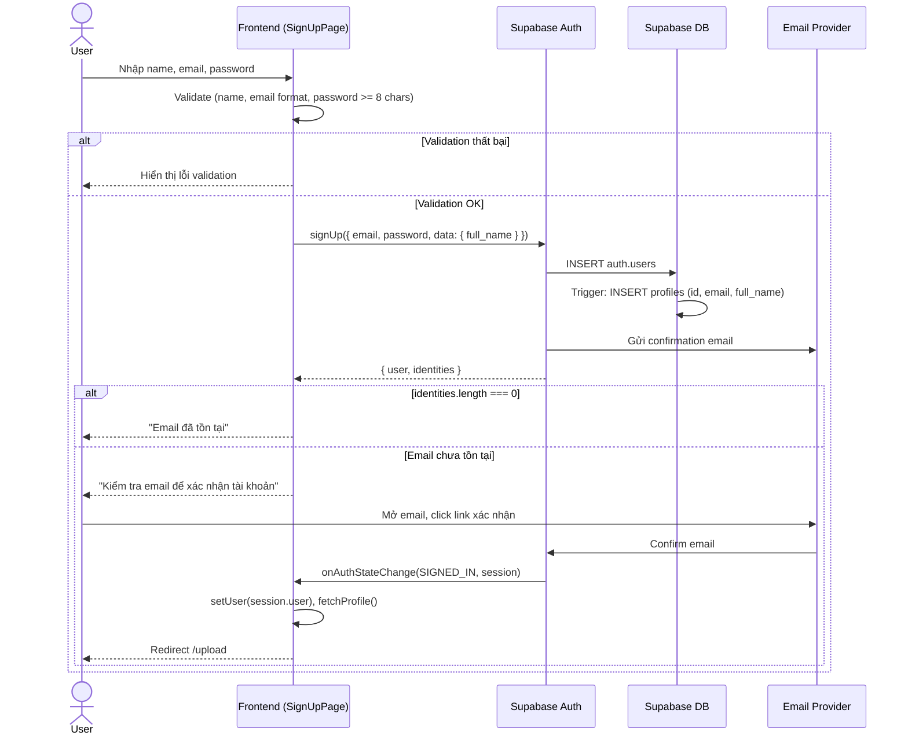
```mermaid
sequenceDiagram
    actor User
    participant FE as Frontend (SignUpPage)
    participant SB as Supabase Auth
    participant DB as Supabase DB
    participant Email as Email Provider

    User->>FE: Nhập name, email, password
    FE->>FE: Validate (name, email format, password >= 8 chars)
    alt Validation thất bại
        FE-->>User: Hiển thị lỗi validation
    else Validation OK
        FE->>SB: signUp({ email, password, data: { full_name } })
        SB->>DB: INSERT auth.users
        DB->>DB: Trigger: INSERT profiles (id, email, full_name)
        SB->>Email: Gửi confirmation email
        SB-->>FE: { user, identities }
        alt identities.length === 0
            FE-->>User: "Email đã tồn tại"
        else Email chưa tồn tại
            FE-->>User: "Kiểm tra email để xác nhận tài khoản"
            User->>Email: Mở email, click link xác nhận
            Email->>SB: Confirm email
            SB->>FE: onAuthStateChange(SIGNED_IN, session)
            FE->>FE: setUser(session.user), fetchProfile()
            FE-->>User: Redirect /upload
        end
    end
```

---

## UC-05: Đăng ký bằng Google OAuth

Áp dụng tương tự cho UC-06 (GitHub), UC-08 (Google login), UC-09 (GitHub login).

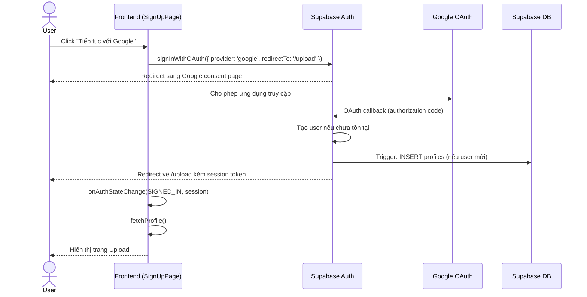
```mermaid
sequenceDiagram
    actor User
    participant FE as Frontend (SignUpPage)
    participant SB as Supabase Auth
    participant Google as Google OAuth
    participant DB as Supabase DB

    User->>FE: Click "Tiếp tục với Google"
    FE->>SB: signInWithOAuth({ provider: 'google', redirectTo: '/upload' })
    SB-->>User: Redirect sang Google consent page
    User->>Google: Cho phép ứng dụng truy cập
    Google->>SB: OAuth callback (authorization code)
    SB->>SB: Tạo user nếu chưa tồn tại
    SB->>DB: Trigger: INSERT profiles (nếu user mới)
    SB-->>User: Redirect về /upload kèm session token
    FE->>FE: onAuthStateChange(SIGNED_IN, session)
    FE->>FE: fetchProfile()
    FE-->>User: Hiển thị trang Upload
```

---

## UC-07: Đăng nhập bằng Email

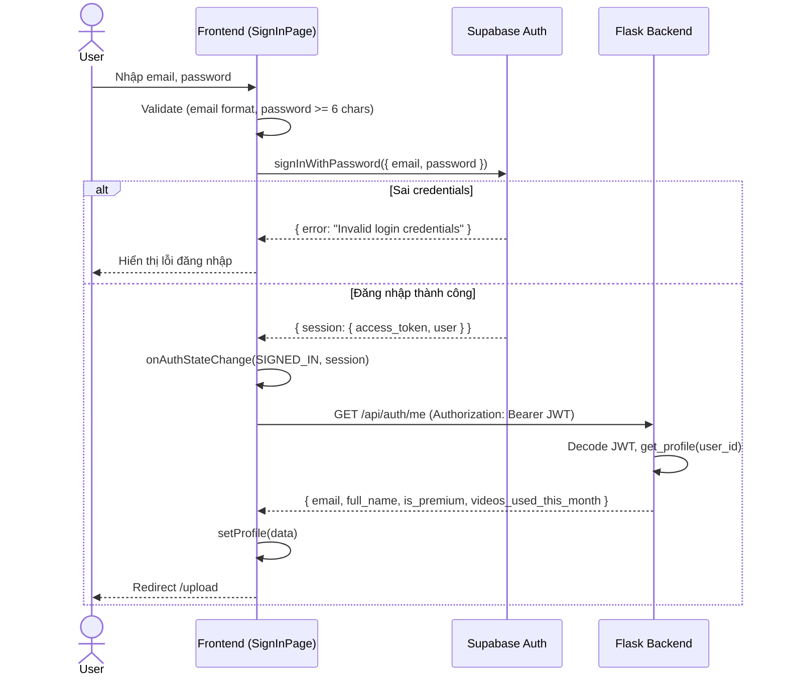
```mermaid
sequenceDiagram
    actor User
    participant FE as Frontend (SignInPage)
    participant SB as Supabase Auth
    participant Flask as Flask Backend

    User->>FE: Nhập email, password
    FE->>FE: Validate (email format, password >= 6 chars)
    FE->>SB: signInWithPassword({ email, password })
    alt Sai credentials
        SB-->>FE: { error: "Invalid login credentials" }
        FE-->>User: Hiển thị lỗi đăng nhập
    else Đăng nhập thành công
        SB-->>FE: { session: { access_token, user } }
        FE->>FE: onAuthStateChange(SIGNED_IN, session)
        FE->>Flask: GET /api/auth/me (Authorization: Bearer JWT)
        Flask->>Flask: Decode JWT, get_profile(user_id)
        Flask-->>FE: { email, full_name, is_premium, videos_used_this_month }
        FE->>FE: setProfile(data)
        FE-->>User: Redirect /upload
    end
```

---

## UC-10: Quên mật khẩu

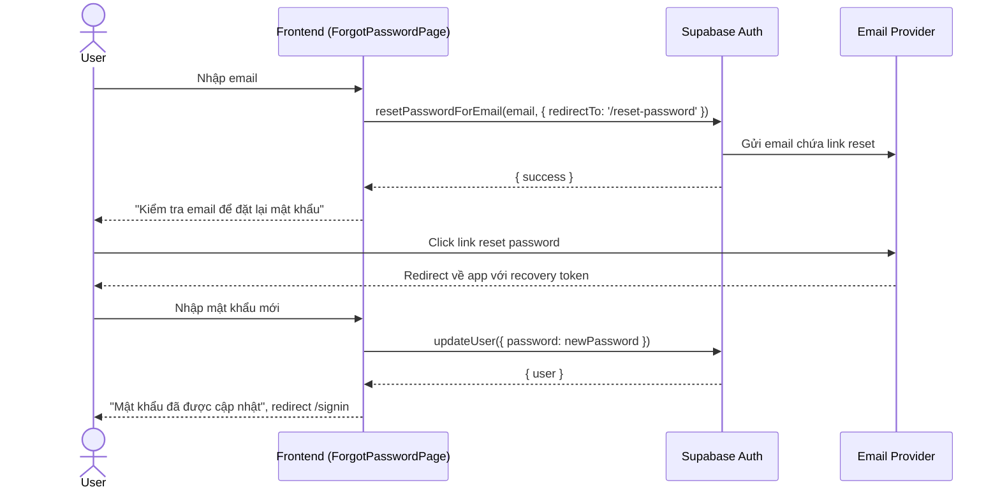
```mermaid
sequenceDiagram
    actor User
    participant FE as Frontend (ForgotPasswordPage)
    participant SB as Supabase Auth
    participant Email as Email Provider

    User->>FE: Nhập email
    FE->>SB: resetPasswordForEmail(email, { redirectTo: '/reset-password' })
    SB->>Email: Gửi email chứa link reset
    SB-->>FE: { success }
    FE-->>User: "Kiểm tra email để đặt lại mật khẩu"
    User->>Email: Click link reset password
    Email-->>User: Redirect về app với recovery token
    User->>FE: Nhập mật khẩu mới
    FE->>SB: updateUser({ password: newPassword })
    SB-->>FE: { user }
    FE-->>User: "Mật khẩu đã được cập nhật", redirect /signin
```

---

## UC-11: Truy cập trang Protected

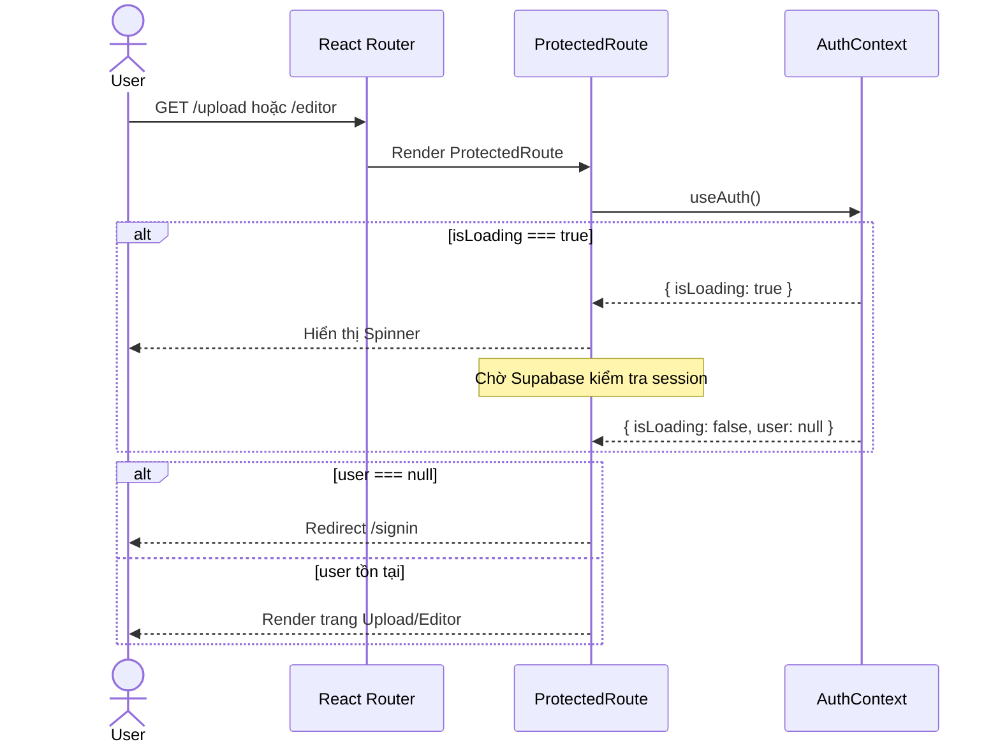
```mermaid
sequenceDiagram
    actor User
    participant Router as React Router
    participant PR as ProtectedRoute
    participant Auth as AuthContext

    User->>Router: GET /upload hoặc /editor
    Router->>PR: Render ProtectedRoute
    PR->>Auth: useAuth()

    alt isLoading === true
        Auth-->>PR: { isLoading: true }
        PR-->>User: Hiển thị Spinner
        Note over PR: Chờ Supabase kiểm tra session
        Auth-->>PR: { isLoading: false, user: null }
    end

    alt user === null
        PR-->>User: Redirect /signin
    else user tồn tại
        PR-->>User: Render trang Upload/Editor
    end
```

---

## UC-12/13/15: Upload & Xử lý Normal Mode

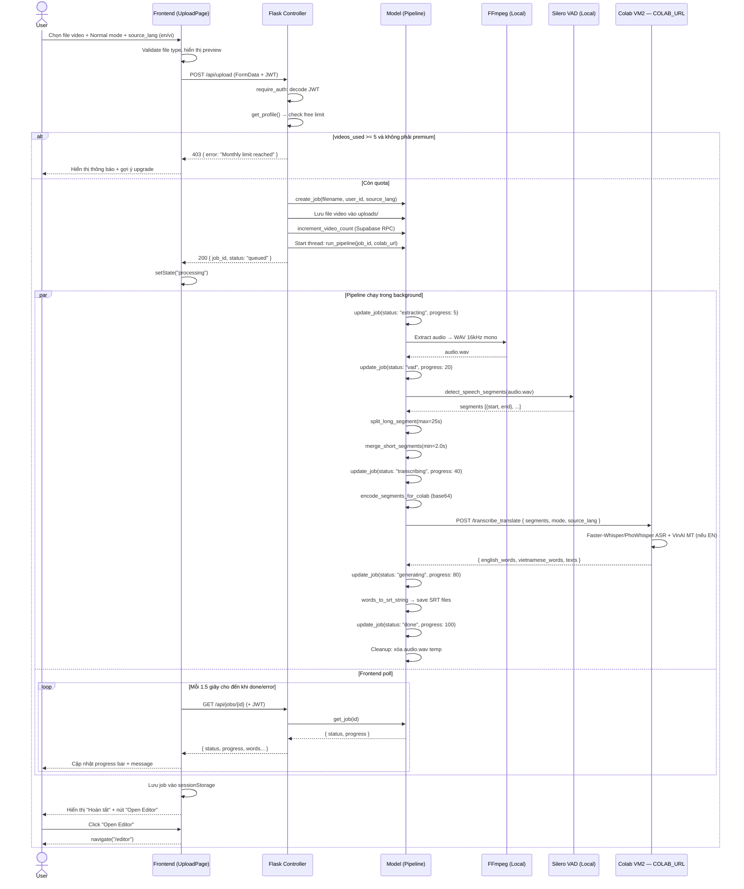
```mermaid
sequenceDiagram
    actor User
    participant FE as Frontend (UploadPage)
    participant Flask as Flask Controller
    participant Model as Model (Pipeline)
    participant FFmpeg as FFmpeg (Local)
    participant VAD as Silero VAD (Local)
    participant VM2 as Colab VM2 — COLAB_URL

    User->>FE: Chọn file video + Normal mode + source_lang (en/vi)
    FE->>FE: Validate file type, hiển thị preview

    FE->>Flask: POST /api/upload (FormData + JWT)
    Flask->>Flask: require_auth: decode JWT
    Flask->>Flask: get_profile() → check free limit
    alt videos_used >= 5 và không phải premium
        Flask-->>FE: 403 { error: "Monthly limit reached" }
        FE-->>User: Hiển thị thông báo + gợi ý upgrade
    else Còn quota
        Flask->>Model: create_job(filename, user_id, source_lang)
        Flask->>Model: Lưu file video vào uploads/
        Flask->>Model: increment_video_count (Supabase RPC)

        Flask->>Model: Start thread: run_pipeline(job_id, colab_url)
        Flask-->>FE: 200 { job_id, status: "queued" }

        FE->>FE: setState("processing")

        par Pipeline chạy trong background
            Model->>Model: update_job(status: "extracting", progress: 5)
            Model->>FFmpeg: Extract audio → WAV 16kHz mono
            FFmpeg-->>Model: audio.wav

            Model->>Model: update_job(status: "vad", progress: 20)
            Model->>VAD: detect_speech_segments(audio.wav)
            VAD-->>Model: segments [{start, end}, ...]
            Model->>Model: split_long_segment(max=25s)
            Model->>Model: merge_short_segments(min=2.0s)

            Model->>Model: update_job(status: "transcribing", progress: 40)
            Model->>Model: encode_segments_for_colab (base64)
            Model->>VM2: POST /transcribe_translate { segments, mode, source_lang }
            VM2->>VM2: Faster-Whisper/PhoWhisper ASR + VinAI MT (nếu EN)
            VM2-->>Model: { english_words, vietnamese_words, texts }

            Model->>Model: update_job(status: "generating", progress: 80)
            Model->>Model: words_to_srt_string → save SRT files

            Model->>Model: update_job(status: "done", progress: 100)
            Model->>Model: Cleanup: xóa audio.wav temp
        and Frontend poll
            loop Mỗi 1.5 giây cho đến khi done/error
                FE->>Flask: GET /api/jobs/{id} (+ JWT)
                Flask->>Model: get_job(id)
                Model-->>Flask: { status, progress }
                Flask-->>FE: { status, progress, words... }
                FE-->>User: Cập nhật progress bar + message
            end
        end

        FE->>FE: Lưu job vào sessionStorage
        FE-->>User: Hiển thị "Hoàn tất" + nút "Open Editor"
        User->>FE: Click "Open Editor"
        FE-->>User: navigate("/editor")
    end
```

---

## UC-14/16: Free User bị chặn

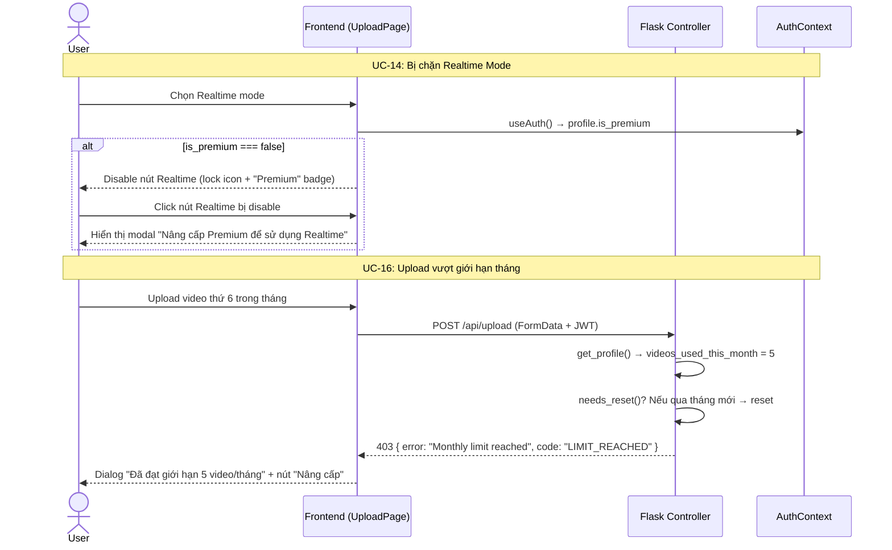
```mermaid
sequenceDiagram
    actor User
    participant FE as Frontend (UploadPage)
    participant Flask as Flask Controller
    participant Auth as AuthContext

    Note over User,Auth: UC-14: Bị chặn Realtime Mode
    User->>FE: Chọn Realtime mode
    FE->>Auth: useAuth() → profile.is_premium
    alt is_premium === false
        FE-->>User: Disable nút Realtime (lock icon + "Premium" badge)
        User->>FE: Click nút Realtime bị disable
        FE-->>User: Hiển thị modal "Nâng cấp Premium để sử dụng Realtime"
    end

    Note over User,Auth: UC-16: Upload vượt giới hạn tháng
    User->>FE: Upload video thứ 6 trong tháng
    FE->>Flask: POST /api/upload (FormData + JWT)
    Flask->>Flask: get_profile() → videos_used_this_month = 5
    Flask->>Flask: needs_reset()? Nếu qua tháng mới → reset
    Flask-->>FE: 403 { error: "Monthly limit reached", code: "LIMIT_REACHED" }
    FE-->>User: Dialog "Đã đạt giới hạn 5 video/tháng" + nút "Nâng cấp"
```

---

## UC-32/33: Upload & Xử lý Realtime Mode

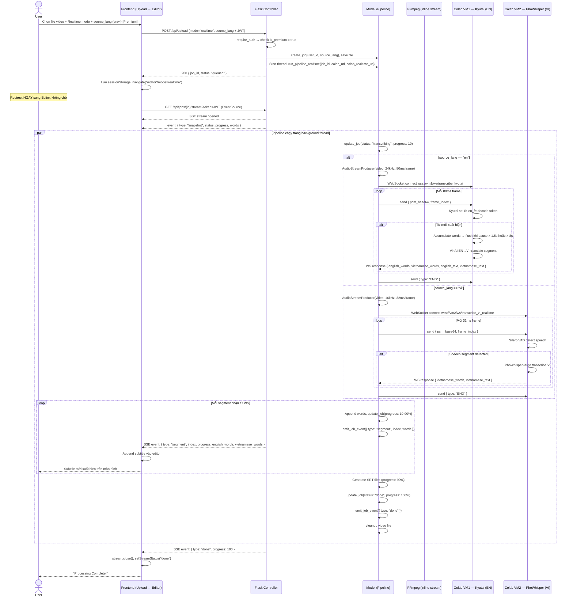
```mermaid
sequenceDiagram
    actor User
    participant FE as Frontend (Upload → Editor)
    participant Flask as Flask Controller
    participant Model as Model (Pipeline)
    participant FFmpeg as FFmpeg (inline stream)
    participant VM1 as Colab VM1 — Kyutai (EN)
    participant VM2 as Colab VM2 — PhoWhisper (VI)

    User->>FE: Chọn file video + Realtime mode + source_lang (en/vi) [Premium]
    FE->>Flask: POST /api/upload (mode="realtime", source_lang + JWT)
    Flask->>Flask: require_auth → check is_premium = true
    Flask->>Model: create_job(user_id, source_lang), save file
    Flask->>Model: Start thread: run_pipeline_realtime(job_id, colab_url, colab_realtime_url)
    Flask-->>FE: 200 { job_id, status: "queued" }

    FE->>FE: Lưu sessionStorage, navigate("/editor?mode=realtime")
    Note over User: Redirect NGAY sang Editor, không chờ

    FE->>Flask: GET /api/jobs/{id}/stream?token=JWT (EventSource)
    Flask-->>FE: SSE stream opened
    Flask-->>FE: event: { type: "snapshot", status, progress, words }

    par Pipeline chạy trong background thread
        Model->>Model: update_job(status: "transcribing", progress: 10)

        alt source_lang == "en"
            Model->>Model: AudioStreamProducer(video, 24kHz, 80ms/frame)
            Model->>VM1: WebSocket connect wss://vm1/ws/transcribe_kyutai
            loop Mỗi 80ms frame
                Model->>VM1: send { pcm_base64, frame_index }
                VM1->>VM1: Kyutai stt-1b-en_fr: decode token
                alt Từ mới xuất hiện
                    VM1->>VM1: Accumulate words → flush khi pause > 1.5s hoặc > 8s
                    VM1->>VM1: VinAI EN→VI translate segment
                    VM1-->>Model: WS response { english_words, vietnamese_words, english_text, vietnamese_text }
                end
            end
            Model->>VM1: send { type: "END" }
        else source_lang == "vi"
            Model->>Model: AudioStreamProducer(video, 16kHz, 32ms/frame)
            Model->>VM2: WebSocket connect wss://vm2/ws/transcribe_vi_realtime
            loop Mỗi 32ms frame
                Model->>VM2: send { pcm_base64, frame_index }
                VM2->>VM2: Silero VAD detect speech
                alt Speech segment detected
                    VM2->>VM2: PhoWhisper-large transcribe VI
                    VM2-->>Model: WS response { vietnamese_words, vietnamese_text }
                end
            end
            Model->>VM2: send { type: "END" }
        end

        loop Mỗi segment nhận từ WS
            Model->>Model: Append words, update_job(progress: 10-90%)
            Model->>Model: emit_job_event({ type: "segment", index, words })
            Flask-->>FE: SSE event: { type: "segment", index, progress, english_words, vietnamese_words }
            FE->>FE: Append subtitle vào editor
            FE-->>User: Subtitle mới xuất hiện trên màn hình
        end

        Model->>Model: Generate SRT files (progress: 90%)
        Model->>Model: update_job(status: "done", progress: 100%)
        Model->>Model: emit_job_event({ type: "done" })
        Model->>Model: cleanup video file
    end

    Flask-->>FE: SSE event: { type: "done", progress: 100 }
    FE->>FE: stream.close(), setStreamStatus("done")
    FE-->>User: "Processing Complete!"
```

---

## UC-17/18/19/20: Editor

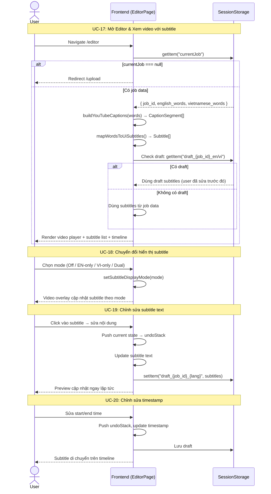
```mermaid
sequenceDiagram
    actor User
    participant FE as Frontend (EditorPage)
    participant SS as SessionStorage

    Note over User,SS: UC-17: Mở Editor & Xem video với subtitle
    User->>FE: Navigate /editor
    FE->>SS: getItem("currentJob")
    alt currentJob === null
        FE-->>User: Redirect /upload
    else Có job data
        SS-->>FE: { job_id, english_words, vietnamese_words }
        FE->>FE: buildYouTubeCaptions(words) → CaptionSegment[]
        FE->>FE: mapWordsToUiSubtitles() → Subtitle[]
        FE->>SS: Check draft: getItem("draft_{job_id}_en/vi")
        alt Có draft
            SS-->>FE: Dùng draft subtitles (user đã sửa trước đó)
        else Không có draft
            FE->>FE: Dùng subtitles từ job data
        end
        FE-->>User: Render video player + subtitle list + timeline
    end

    Note over User,SS: UC-18: Chuyển đổi hiển thị subtitle
    User->>FE: Chọn mode (Off / EN-only / VI-only / Dual)
    FE->>FE: setSubtitleDisplayMode(mode)
    FE-->>User: Video overlay cập nhật subtitle theo mode

    Note over User,SS: UC-19: Chỉnh sửa subtitle text
    User->>FE: Click vào subtitle → sửa nội dung
    FE->>FE: Push current state → undoStack
    FE->>FE: Update subtitle text
    FE->>SS: setItem("draft_{job_id}_{lang}", subtitles)
    FE-->>User: Preview cập nhật ngay lập tức

    Note over User,SS: UC-20: Chỉnh sửa timestamp
    User->>FE: Sửa start/end time
    FE->>FE: Push undoStack, update timestamp
    FE->>SS: Lưu draft
    FE-->>User: Subtitle di chuyển trên timeline
```

---

## UC-26/27: Download SRT

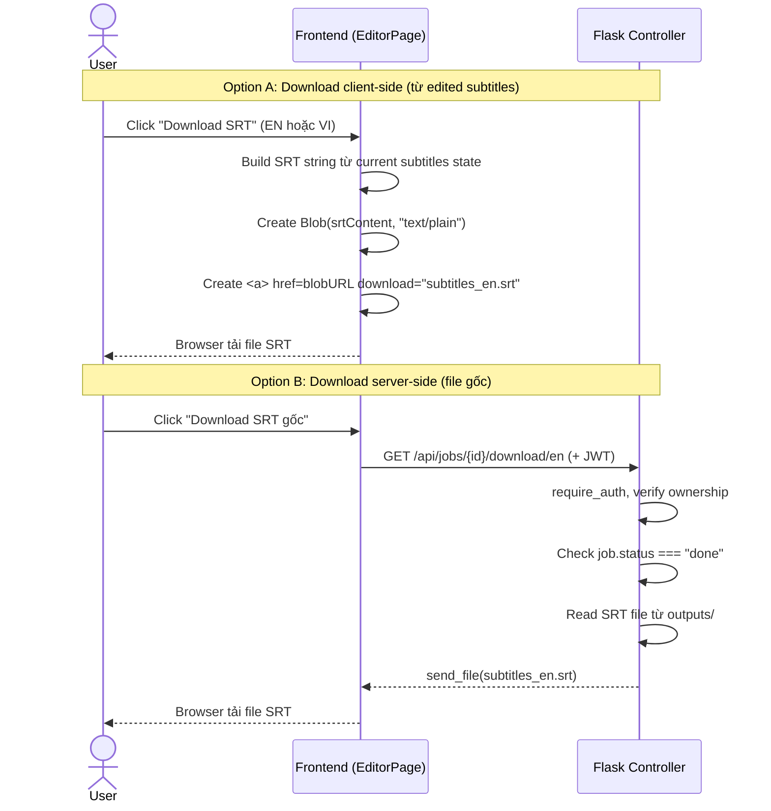
```mermaid
sequenceDiagram
    actor User
    participant FE as Frontend (EditorPage)
    participant Flask as Flask Controller

    Note over User,Flask: Option A: Download client-side (từ edited subtitles)
    User->>FE: Click "Download SRT" (EN hoặc VI)
    FE->>FE: Build SRT string từ current subtitles state
    FE->>FE: Create Blob(srtContent, "text/plain")
    FE->>FE: Create <a> href=blobURL download="subtitles_en.srt"
    FE-->>User: Browser tải file SRT

    Note over User,Flask: Option B: Download server-side (file gốc)
    User->>FE: Click "Download SRT gốc"
    FE->>Flask: GET /api/jobs/{id}/download/en (+ JWT)
    Flask->>Flask: require_auth, verify ownership
    Flask->>Flask: Check job.status === "done"
    Flask->>Flask: Read SRT file từ outputs/
    Flask-->>FE: send_file(subtitles_en.srt)
    FE-->>User: Browser tải file SRT
```

---

## UC-28: Export Video Burned Subtitle

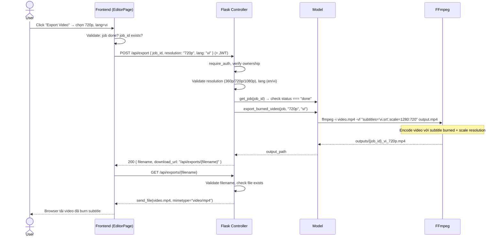
```mermaid
sequenceDiagram
    actor User
    participant FE as Frontend (EditorPage)
    participant Flask as Flask Controller
    participant Model as Model
    participant FFmpeg as FFmpeg

    User->>FE: Click "Export Video" → chọn 720p, lang=vi
    FE->>FE: Validate: job done? job_id exists?
    FE->>Flask: POST /api/export { job_id, resolution: "720p", lang: "vi" } (+ JWT)

    Flask->>Flask: require_auth, verify ownership
    Flask->>Flask: Validate resolution (360p/720p/1080p), lang (en/vi)
    Flask->>Model: get_job(job_id) → check status === "done"
    Flask->>Model: export_burned_video(job, "720p", "vi")

    Model->>FFmpeg: ffmpeg -i video.mp4 -vf "subtitles='vi.srt',scale=1280:720" output.mp4
    Note over FFmpeg: Encode video với subtitle burned + scale resolution
    FFmpeg-->>Model: outputs/{job_id}_vi_720p.mp4

    Model-->>Flask: output_path
    Flask-->>FE: 200 { filename, download_url: "/api/exports/{filename}" }

    FE->>Flask: GET /api/exports/{filename}
    Flask->>Flask: Validate filename, check file exists
    Flask-->>FE: send_file(video.mp4, mimetype="video/mp4")
    FE-->>User: Browser tải video đã burn subtitle
```

---

## UC-29: Xem thông tin tài khoản

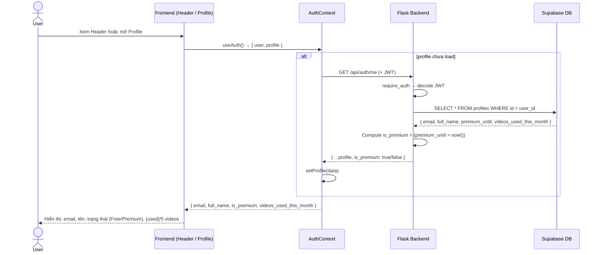
```mermaid
sequenceDiagram
    actor User
    participant FE as Frontend (Header / Profile)
    participant Auth as AuthContext
    participant Flask as Flask Backend
    participant DB as Supabase DB

    User->>FE: Xem Header hoặc mở Profile
    FE->>Auth: useAuth() → { user, profile }

    alt profile chưa load
        Auth->>Flask: GET /api/auth/me (+ JWT)
        Flask->>Flask: require_auth → decode JWT
        Flask->>DB: SELECT * FROM profiles WHERE id = user_id
        DB-->>Flask: { email, full_name, premium_until, videos_used_this_month }
        Flask->>Flask: Compute is_premium = (premium_until > now())
        Flask-->>Auth: { ...profile, is_premium: true/false }
        Auth->>Auth: setProfile(data)
    end

    Auth-->>FE: { email, full_name, is_premium, videos_used_this_month }
    FE-->>User: Hiển thị: email, tên, trạng thái (Free/Premium), {used}/5 videos
```

---

## UC-30: Đăng xuất

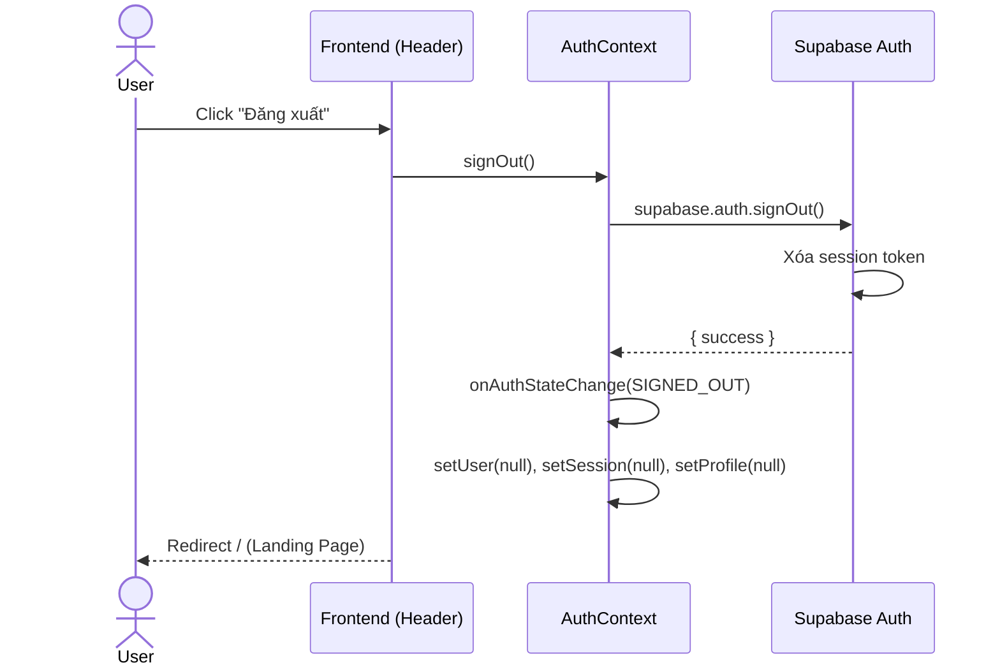
```mermaid
sequenceDiagram
    actor User
    participant FE as Frontend (Header)
    participant Auth as AuthContext
    participant SB as Supabase Auth

    User->>FE: Click "Đăng xuất"
    FE->>Auth: signOut()
    Auth->>SB: supabase.auth.signOut()
    SB->>SB: Xóa session token
    SB-->>Auth: { success }
    Auth->>Auth: onAuthStateChange(SIGNED_OUT)
    Auth->>Auth: setUser(null), setSession(null), setProfile(null)
    FE-->>User: Redirect / (Landing Page)
```

---

## UC-31/36: Nâng cấp Premium (PayOS)

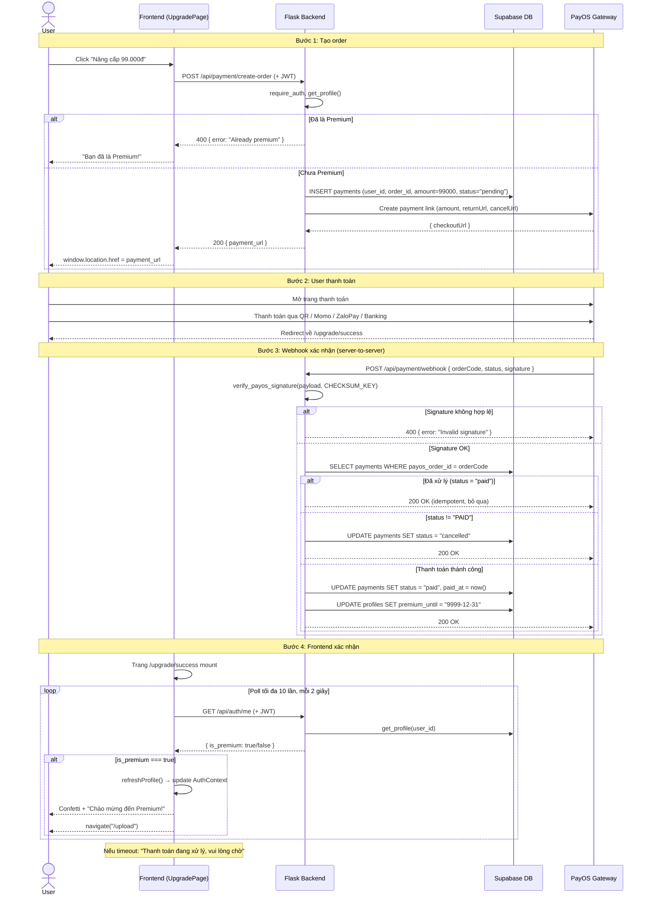
```mermaid
sequenceDiagram
    actor User
    participant FE as Frontend (UpgradePage)
    participant Flask as Flask Backend
    participant DB as Supabase DB
    participant PayOS as PayOS Gateway

    Note over User,PayOS: Bước 1: Tạo order
    User->>FE: Click "Nâng cấp 99.000đ"
    FE->>Flask: POST /api/payment/create-order (+ JWT)
    Flask->>Flask: require_auth, get_profile()
    alt Đã là Premium
        Flask-->>FE: 400 { error: "Already premium" }
        FE-->>User: "Bạn đã là Premium!"
    else Chưa Premium
        Flask->>DB: INSERT payments (user_id, order_id, amount=99000, status="pending")
        Flask->>PayOS: Create payment link (amount, returnUrl, cancelUrl)
        PayOS-->>Flask: { checkoutUrl }
        Flask-->>FE: 200 { payment_url }
        FE-->>User: window.location.href = payment_url
    end

    Note over User,PayOS: Bước 2: User thanh toán
    User->>PayOS: Mở trang thanh toán
    User->>PayOS: Thanh toán qua QR / Momo / ZaloPay / Banking
    PayOS-->>User: Redirect về /upgrade/success

    Note over User,PayOS: Bước 3: Webhook xác nhận (server-to-server)
    PayOS->>Flask: POST /api/payment/webhook { orderCode, status, signature }
    Flask->>Flask: verify_payos_signature(payload, CHECKSUM_KEY)
    alt Signature không hợp lệ
        Flask-->>PayOS: 400 { error: "Invalid signature" }
    else Signature OK
        Flask->>DB: SELECT payments WHERE payos_order_id = orderCode
        alt Đã xử lý (status = "paid")
            Flask-->>PayOS: 200 OK (idempotent, bỏ qua)
        else status != "PAID"
            Flask->>DB: UPDATE payments SET status = "cancelled"
            Flask-->>PayOS: 200 OK
        else Thanh toán thành công
            Flask->>DB: UPDATE payments SET status = "paid", paid_at = now()
            Flask->>DB: UPDATE profiles SET premium_until = "9999-12-31"
            Flask-->>PayOS: 200 OK
        end
    end

    Note over User,PayOS: Bước 4: Frontend xác nhận
    FE->>FE: Trang /upgrade/success mount
    loop Poll tối đa 10 lần, mỗi 2 giây
        FE->>Flask: GET /api/auth/me (+ JWT)
        Flask->>DB: get_profile(user_id)
        Flask-->>FE: { is_premium: true/false }
        alt is_premium === true
            FE->>FE: refreshProfile() → update AuthContext
            FE-->>User: Confetti + "Chào mừng đến Premium!"
            FE-->>User: navigate("/upload")
        end
    end
    Note over FE: Nếu timeout: "Thanh toán đang xử lý, vui lòng chờ"
```

---

## UC-37: Colab VM2 xử lý ASR + MT (Normal Mode)

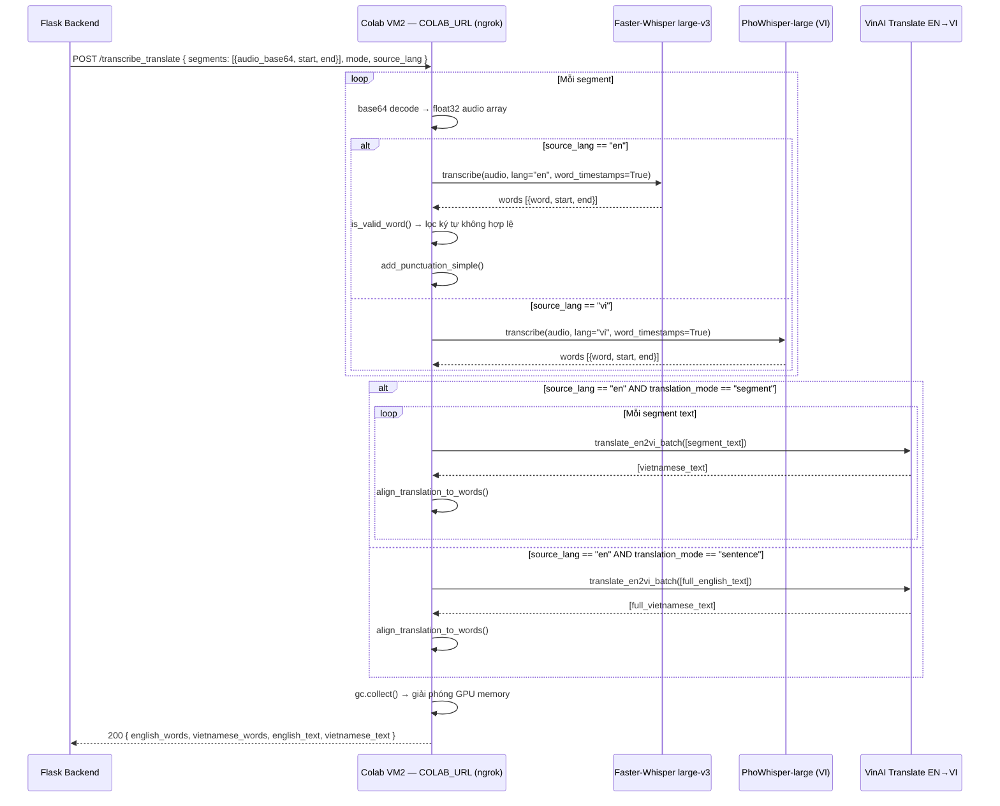
```mermaid
sequenceDiagram
    participant Flask as Flask Backend
    participant VM2 as Colab VM2 — COLAB_URL (ngrok)
    participant Whisper as Faster-Whisper large-v3
    participant PhoW as PhoWhisper-large (VI)
    participant VinAI as VinAI Translate EN→VI

    Flask->>VM2: POST /transcribe_translate { segments: [{audio_base64, start, end}], mode, source_lang }

    loop Mỗi segment
        VM2->>VM2: base64 decode → float32 audio array
        alt source_lang == "en"
            VM2->>Whisper: transcribe(audio, lang="en", word_timestamps=True)
            Whisper-->>VM2: words [{word, start, end}]
            VM2->>VM2: is_valid_word() → lọc ký tự không hợp lệ
            VM2->>VM2: add_punctuation_simple()
        else source_lang == "vi"
            VM2->>PhoW: transcribe(audio, lang="vi", word_timestamps=True)
            PhoW-->>VM2: words [{word, start, end}]
        end
    end

    alt source_lang == "en" AND translation_mode == "segment"
        loop Mỗi segment text
            VM2->>VinAI: translate_en2vi_batch([segment_text])
            VinAI-->>VM2: [vietnamese_text]
            VM2->>VM2: align_translation_to_words()
        end
    else source_lang == "en" AND translation_mode == "sentence"
        VM2->>VinAI: translate_en2vi_batch([full_english_text])
        VinAI-->>VM2: [full_vietnamese_text]
        VM2->>VM2: align_translation_to_words()
    end

    VM2->>VM2: gc.collect() → giải phóng GPU memory
    VM2-->>Flask: 200 { english_words, vietnamese_words, english_text, vietnamese_text }
```

---

## UC-38: Colab VM1 — EN Realtime WebSocket (Kyutai)

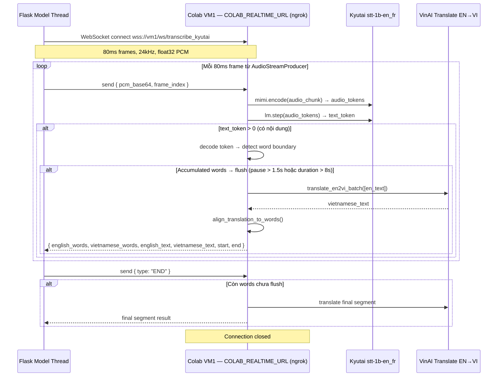
```mermaid
sequenceDiagram
    participant Model as Flask Model Thread
    participant VM1 as Colab VM1 — COLAB_REALTIME_URL (ngrok)
    participant Kyutai as Kyutai stt-1b-en_fr
    participant VinAI as VinAI Translate EN→VI

    Model->>VM1: WebSocket connect wss://vm1/ws/transcribe_kyutai
    Note over Model,VM1: 80ms frames, 24kHz, float32 PCM

    loop Mỗi 80ms frame từ AudioStreamProducer
        Model->>VM1: send { pcm_base64, frame_index }
        VM1->>Kyutai: mimi.encode(audio_chunk) → audio_tokens
        VM1->>Kyutai: lm.step(audio_tokens) → text_token
        alt text_token > 0 (có nội dung)
            VM1->>VM1: decode token → detect word boundary
            alt Accumulated words → flush (pause > 1.5s hoặc duration > 8s)
                VM1->>VinAI: translate_en2vi_batch([en_text])
                VinAI-->>VM1: vietnamese_text
                VM1->>VM1: align_translation_to_words()
                VM1-->>Model: { english_words, vietnamese_words, english_text, vietnamese_text, start, end }
            end
        end
    end

    Model->>VM1: send { type: "END" }
    alt Còn words chưa flush
        VM1->>VinAI: translate final segment
        VM1-->>Model: final segment result
    end
    Note over VM1: Connection closed
```

---

## UC-39: Colab VM2 — VI Realtime WebSocket (PhoWhisper)

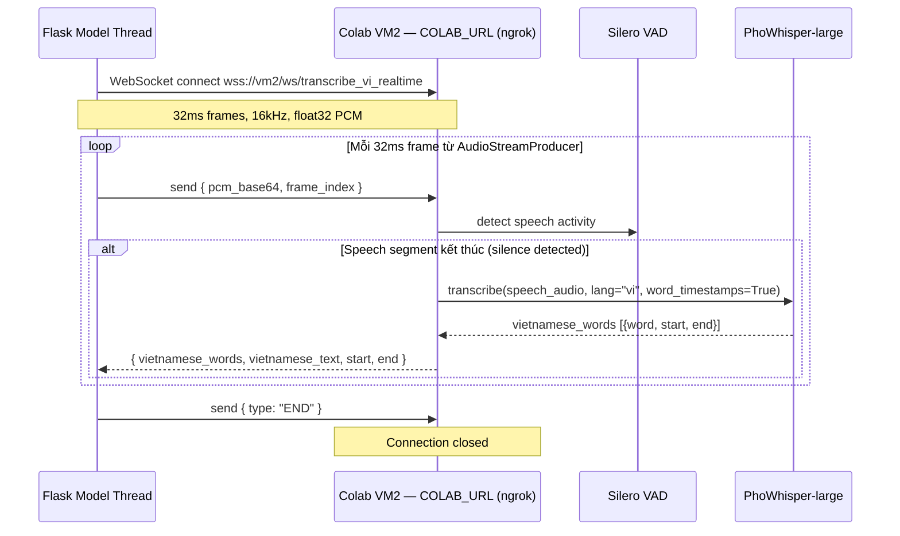
```mermaid
sequenceDiagram
    participant Model as Flask Model Thread
    participant VM2 as Colab VM2 — COLAB_URL (ngrok)
    participant VAD as Silero VAD
    participant PhoW as PhoWhisper-large

    Model->>VM2: WebSocket connect wss://vm2/ws/transcribe_vi_realtime
    Note over Model,VM2: 32ms frames, 16kHz, float32 PCM

    loop Mỗi 32ms frame từ AudioStreamProducer
        Model->>VM2: send { pcm_base64, frame_index }
        VM2->>VAD: detect speech activity
        alt Speech segment kết thúc (silence detected)
            VM2->>PhoW: transcribe(speech_audio, lang="vi", word_timestamps=True)
            PhoW-->>VM2: vietnamese_words [{word, start, end}]
            VM2-->>Model: { vietnamese_words, vietnamese_text, start, end }
        end
    end

    Model->>VM2: send { type: "END" }
    Note over VM2: Connection closed
```

---

## UC-40: Health Check

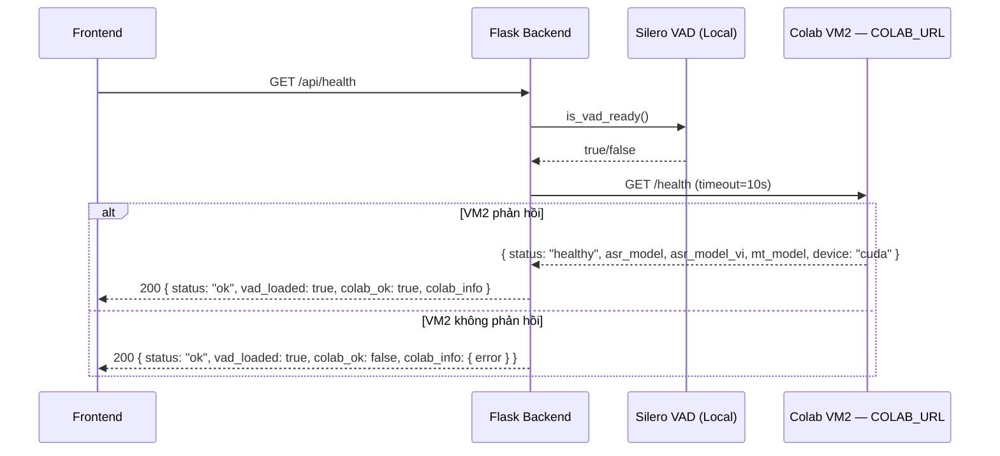
```mermaid
sequenceDiagram
    participant FE as Frontend
    participant Flask as Flask Backend
    participant VAD as Silero VAD (Local)
    participant VM2 as Colab VM2 — COLAB_URL

    FE->>Flask: GET /api/health
    Flask->>VAD: is_vad_ready()
    VAD-->>Flask: true/false

    Flask->>VM2: GET /health (timeout=10s)
    alt VM2 phản hồi
        VM2-->>Flask: { status: "healthy", asr_model, asr_model_vi, mt_model, device: "cuda" }
        Flask-->>FE: 200 { status: "ok", vad_loaded: true, colab_ok: true, colab_info }
    else VM2 không phản hồi
        Flask-->>FE: 200 { status: "ok", vad_loaded: true, colab_ok: false, colab_info: { error } }
    end
```

---

## Tổng quan luồng dữ liệu hệ thống

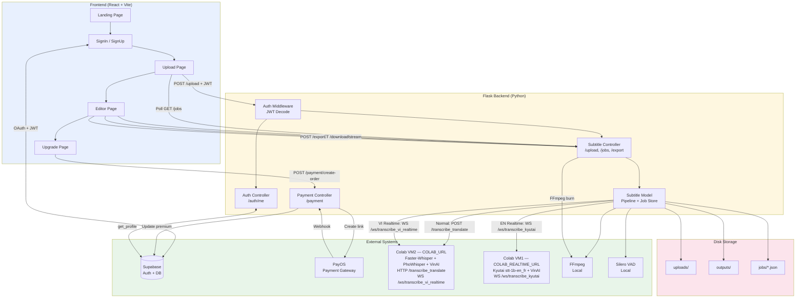
```mermaid
flowchart TB
    subgraph Client ["Frontend (React + Vite)"]
        LP[Landing Page]
        Auth[SignIn / SignUp]
        UP[Upload Page]
        ED[Editor Page]
        UG[Upgrade Page]
    end

    subgraph Backend ["Flask Backend (Python)"]
        MW[Auth Middleware<br/>JWT Decode]
        SC[Subtitle Controller<br/>/upload, /jobs, /export]
        AC[Auth Controller<br/>/auth/me]
        PC[Payment Controller<br/>/payment]
        SM[Subtitle Model<br/>Pipeline + Job Store]
    end

    subgraph External ["External Systems"]
        SB[(Supabase<br/>Auth + DB)]
        PayOS[PayOS<br/>Payment Gateway]
        ColabVM2[Colab VM2 — COLAB_URL<br/>Faster-Whisper + PhoWhisper + VinAI<br/>HTTP /transcribe_translate<br/>WS /ws/transcribe_vi_realtime]
        ColabVM1[Colab VM1 — COLAB_REALTIME_URL<br/>Kyutai stt-1b-en_fr + VinAI<br/>WS /ws/transcribe_kyutai]
        FF[FFmpeg<br/>Local]
        VAD[Silero VAD<br/>Local]
    end

    subgraph Storage ["Disk Storage"]
        UPL[uploads/]
        OUT[outputs/]
        JOBS[jobs/*.json]
    end

    LP --> Auth
    Auth <-->|OAuth + JWT| SB
    Auth --> UP
    UP -->|POST /upload + JWT| MW
    MW --> SC
    SC --> SM
    SM --> FF
    SM --> VAD
    SM -->|Normal: POST /transcribe_translate| ColabVM2
    SM -->|EN Realtime: WS /ws/transcribe_kyutai| ColabVM1
    SM -->|VI Realtime: WS /ws/transcribe_vi_realtime| ColabVM2
    SM --> UPL
    SM --> OUT
    SM --> JOBS

    UP -->|Poll GET /jobs| SC
    UP --> ED
    ED -->|SSE /jobs/stream| SC
    ED -->|GET /download| SC
    ED -->|POST /export| SC
    SC -->|FFmpeg burn| FF

    ED --> UG
    UG -->|POST /payment/create-order| PC
    PC -->|Create link| PayOS
    PayOS -->|Webhook| PC
    PC -->|Update premium| SB

    AC <-->|get_profile| SB
    MW --> AC

    style Client fill:#e8f0fe
    style Backend fill:#fef7e0
    style External fill:#e8f5e9
    style Storage fill:#fce4ec
```

---

## Bảng tóm tắt UC → Sequence Diagram

| Use Case | Diagram | Actors |
|----------|---------|--------|
| UC-04 | Đăng ký Email | Guest, Supabase, Email |
| UC-05/06/08/09 | Đăng ký/nhập OAuth | Guest, Supabase, Google/GitHub |
| UC-07 | Đăng nhập Email | Guest, Supabase, Flask |
| UC-10 | Quên mật khẩu | Guest, Supabase, Email |
| UC-11 | Protected Route | Guest, AuthContext |
| UC-12/13/15 | Upload Normal | Free/Premium User, Flask, Colab |
| UC-14/16 | Bị chặn (limit) | Free User, Flask |
| UC-32/33 | Upload Realtime | Premium User, Flask, Colab |
| UC-17-20 | Editor | Free/Premium User |
| UC-26/27 | Download SRT | Free/Premium User, Flask |
| UC-28 | Export Video | Free/Premium User, Flask, FFmpeg |
| UC-29 | Xem tài khoản | Free/Premium User, Flask, Supabase |
| UC-30 | Đăng xuất | Free/Premium User, Supabase |
| UC-31/36 | Nâng cấp Premium | Free User, Flask, PayOS, Supabase |
| UC-37 | Colab VM2 — Normal ASR+MT | Flask, VM2, Faster-Whisper/PhoWhisper, VinAI |
| UC-38 | Colab VM1 — EN Realtime WS | Flask, VM1, Kyutai stt-1b-en_fr, VinAI |
| UC-39 | Colab VM2 — VI Realtime WS | Flask, VM2, Silero VAD, PhoWhisper-large |
| UC-40 | Health Check | Flask, VM2, Silero VAD |
