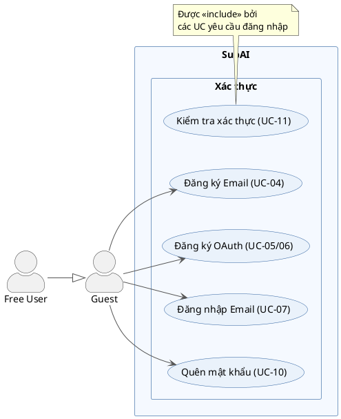
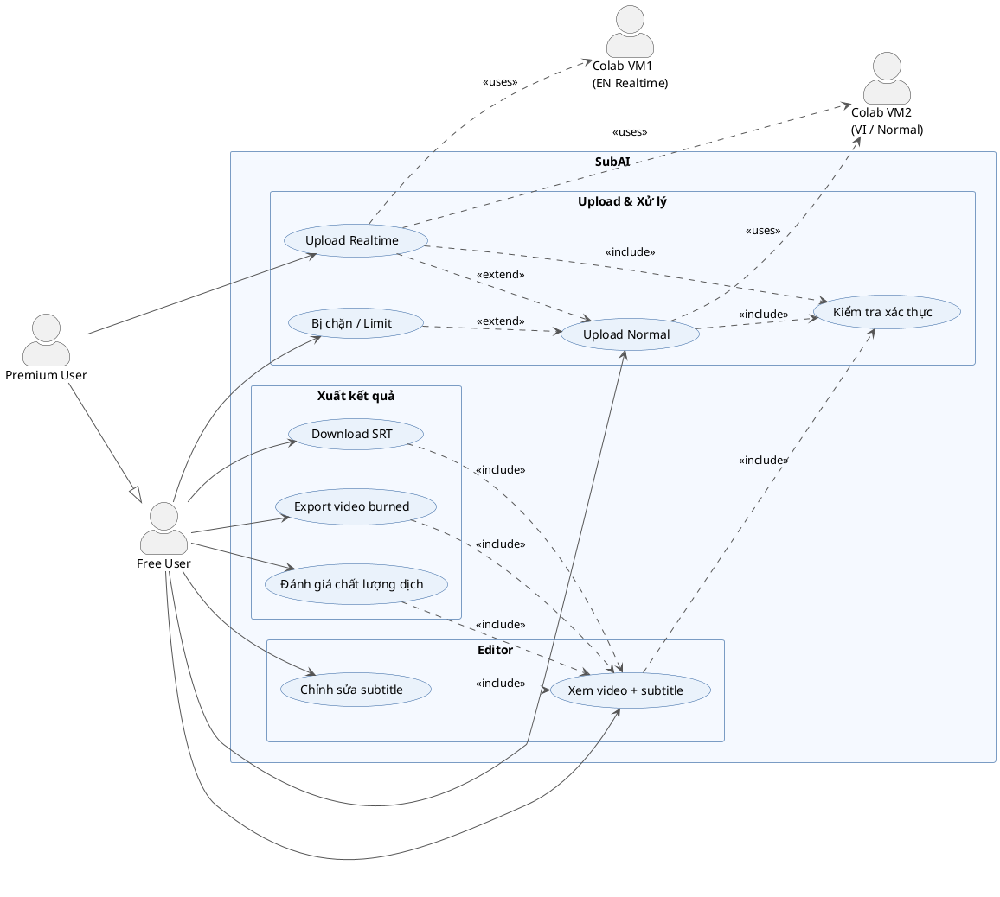
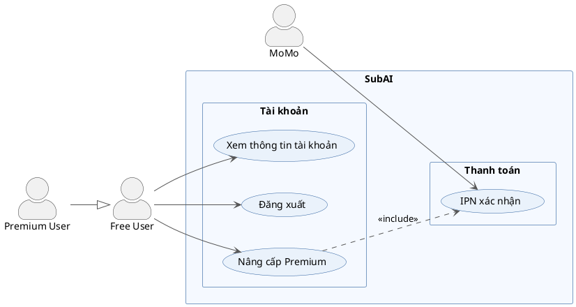

# SubAI — Sơ đồ Use Case (PlantUML)

Render tại [plantuml.com/plantuml](https://www.plantuml.com/plantuml/uml) hoặc VS Code extension **PlantUML**.

Chia thành 3 diagram theo nhóm chức năng:
- **Diagram 1** — Xác thực (Guest)
- **Diagram 2** — Upload & Xử lý (Free User, Premium User, Colab VMs)
- **Diagram 3** — Tài khoản & Thanh toán (Free User, Premium User, MoMo)

---

## Diagram 1 — Xác thực

---

## Diagram 2 — Upload & Xử lý / Editor / Xuất kết quả

---

## Diagram 3 — Tài khoản & Thanh toán

---

## Bảng Actor → Use Case

| Actor | Use Cases |
|-------|-----------|
| Guest | UC-04, UC-05/06, UC-07, UC-10 |
| Free User | UC-12/13/15, UC-14/16, UC-17, UC-18/19/20, UC-26/27, UC-28, UC-41, UC-29, UC-30, UC-31 |
| Premium User | UC-32/33 (+ tất cả của Free User) |
| MoMo | UC-36 |
| Colab VM1 | UC-32/33 (EN Realtime) |
| Colab VM2 | UC-12/13/15 (Normal), UC-32/33 (VI Realtime) |
